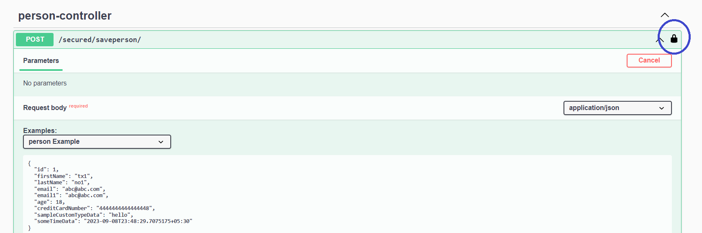

# 03-with-security Demo #

Quite similar to 1-first-example  and 2-first-codegen-example.   
Just a little added security.   

In api-docs.json search for the word security and securitySchemes.   
Also look at src\main\java\com\example\config\WebSecurityConfig.java   

http://localhost:8080/swagger-ui.html   

Click Authorize button.   

Credentials are username:user and password:password    

Press the Authorize button after inputting the credentials.   
Then click the close button on next screen.   

    

Try out the secured/saveperson operation the one with the lock symbol.

Verify that security works.  

This is just a simple proof of security working.

Further details for deeper examples - https://swagger.io/docs/specification/authentication/   

