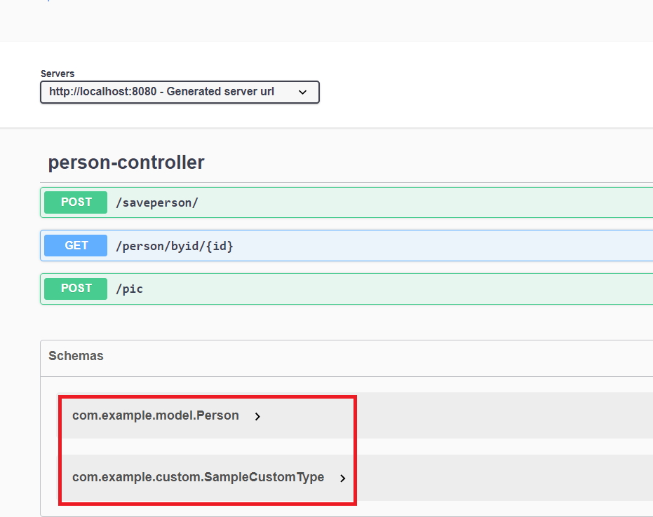

# 04-first-fqn-example Demo #

Quite similar to 1-first-example  .   
Just a little added fqn.   

xdamah-maven-codegen-plugin provides a new config option 
<fqn>true</fqn>   

See pom.xml of this example for more on how this is configured.   

  

