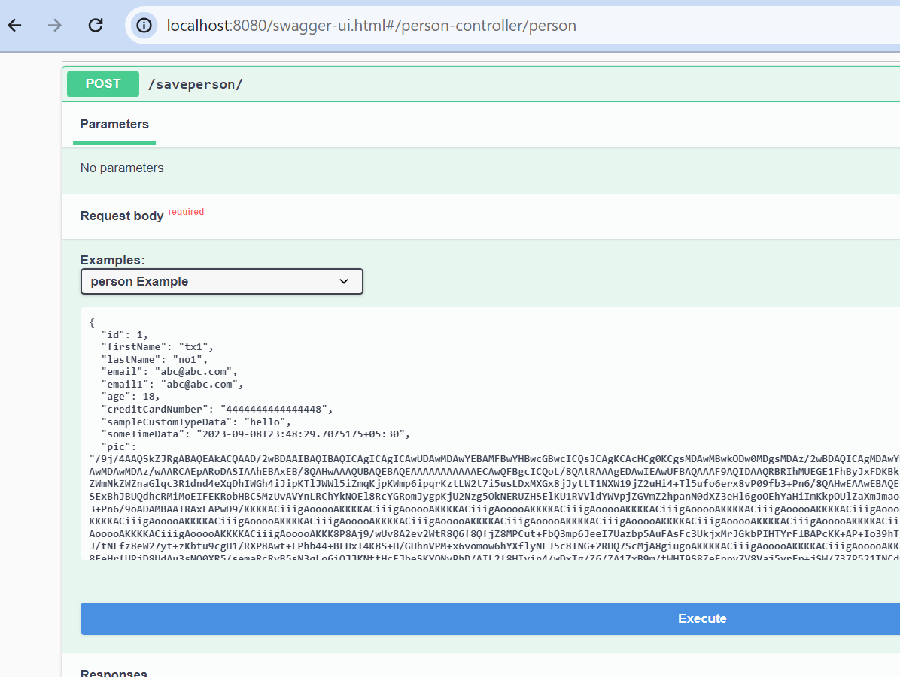
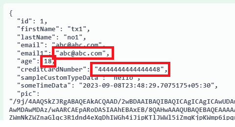
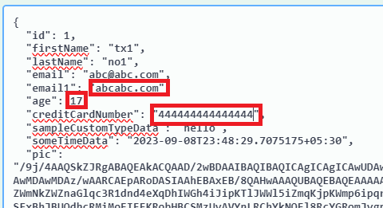
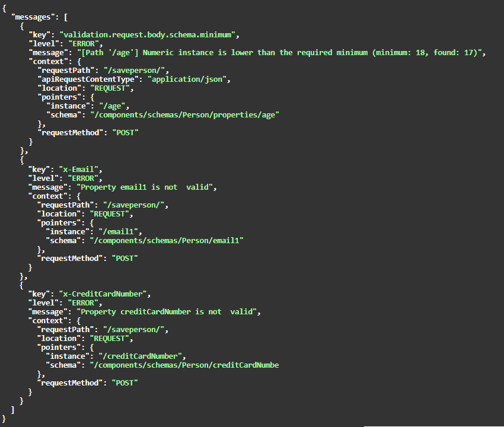

# 1-first-example Demo #

Will capture very quick brief some of the steps.
Hope that helps convey the idea.

### Steps ###
Step1  

Press The blue execute button.
Response  
   

Lets change the input:  
From   
   
to    
  

Specifically changing these values   
From:   
"email1": "abc@abc.com",   
"age": 18,   
"creditCardNumber": "4444444444444448"    

To:   
"email1": "abcabc.com",   
"age": 1,   
"creditCardNumber": "444444444444444"   

Press The blue execute button.   
Validation Response   
 

