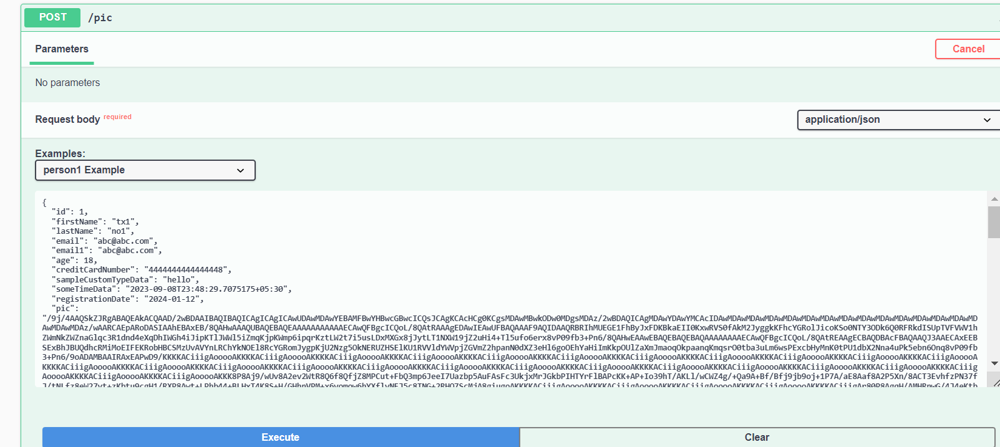

# 1-first-example Demo #

Will capture very quick brief some of the steps.
Hope that helps convey the idea.

### Steps ###
## Steps1 ##  


Press The blue execute button.
Response  
   

Lets change the input:  
From   
   
to    
  

Specifically changing these values   
From:   
"email1": "abc@abc.com",   
"age": 18,   
"creditCardNumber": "4444444444444448"    

To:   
"email1": "abcabc.com",   
"age": 1,   
"creditCardNumber": "444444444444444"   

Press The blue execute button.   
Validation Response   


## Steps2 ##

Lets change the request body   

   

So it looks like this  

   

```json
{
  "id": 1,
  "firstName": "tx1",
  "lastName": "no1",
  "email": "abc@abc.com",
  "email1": "abc@abc.com",
  "age": 18,
  "creditCardNumber": "4444444444444448",
  "sampleCustomTypeData": "hello",
  "someTimeData": "2023-09-08T23:48:29.7075175+05:30",
  "pic": "picattributeistruncated",
  "anotherPerson": {
    "id": 1,
    "firstName": "F2",
    "lastName": "no1",
    "email": "abc@abc.com",
    "email1": "abc@abc.com",
    "age": 18,
    "creditCardNumber": "4444444444444448",
    "sampleCustomTypeData": "hello",
    "someTimeData": "2023-09-08T23:48:29.7075175+05:30"
  },
  "children": [
    {
      "id": 1,
      "firstName": "F3",
      "lastName": "no13",
      "email": "abc@abc.com",
      "email1": "abc@abc.com",
      "age": 18,
      "creditCardNumber": "4444444444444448",
      "sampleCustomTypeData": "hello",
      "someTimeData": "2023-09-08T23:48:29.7075175+05:30"
    }
  ]
}
```
Press The blue execute button.
Response  
   

Lets change the input:  
From   
   
to    
  

Specifically changing these values   
From:   
"email1": "abc@abc.com",   
"age": 18,   
"creditCardNumber": "4444444444444448"    

To:   
"email1": "abcabc.com",   
"age": 1,   
"creditCardNumber": "444444444444444"   

Press The blue execute button.   
Validation Response   
 

