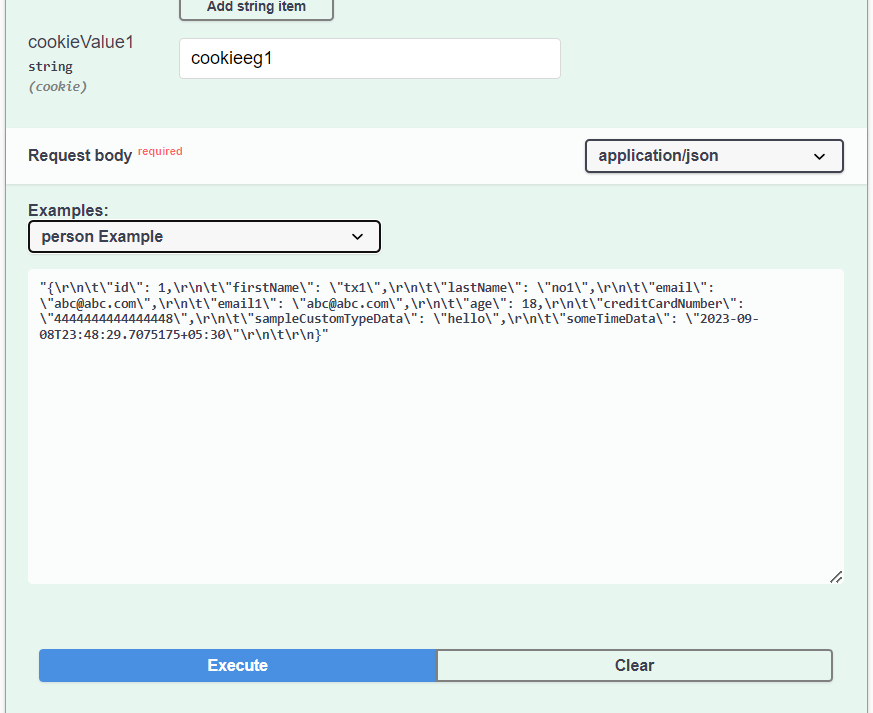
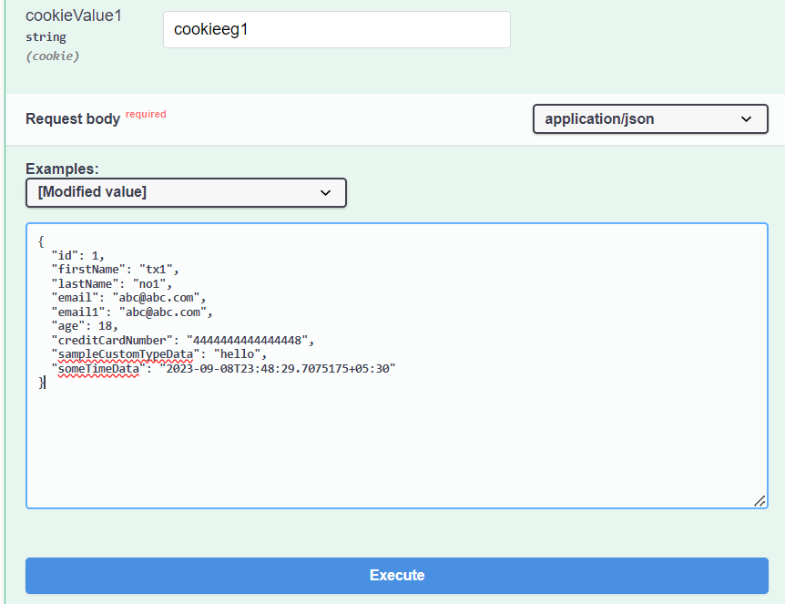
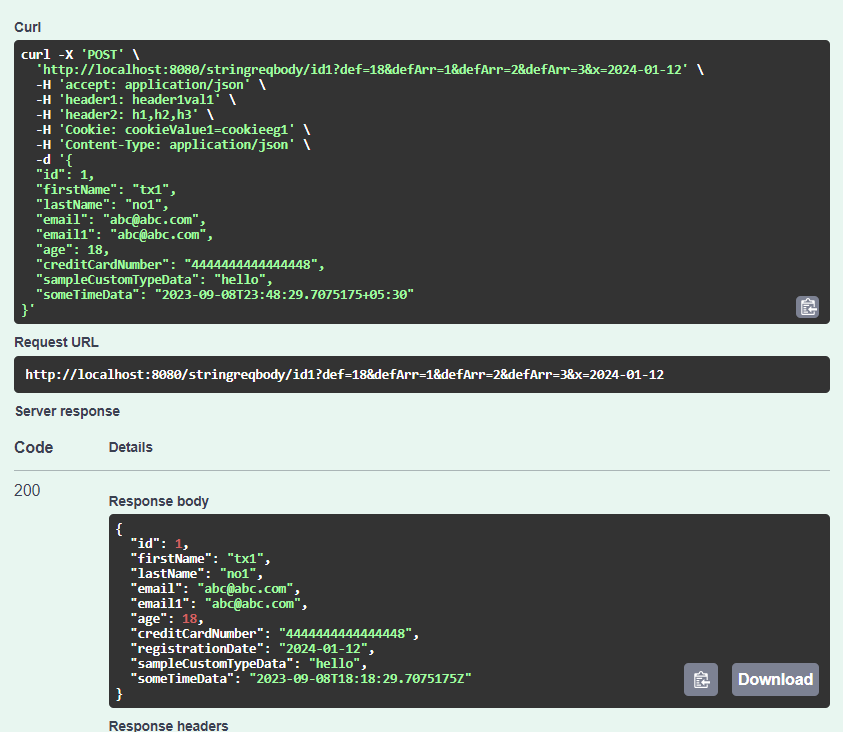
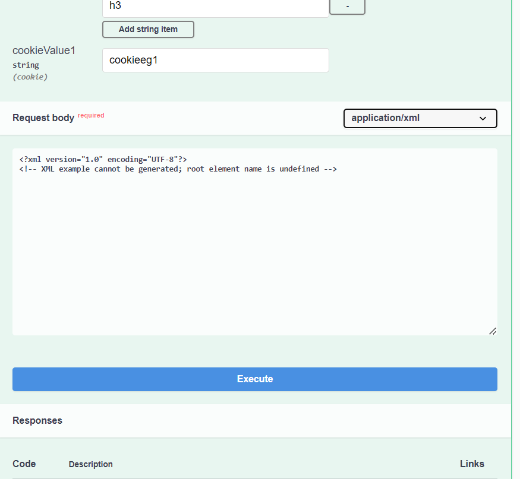
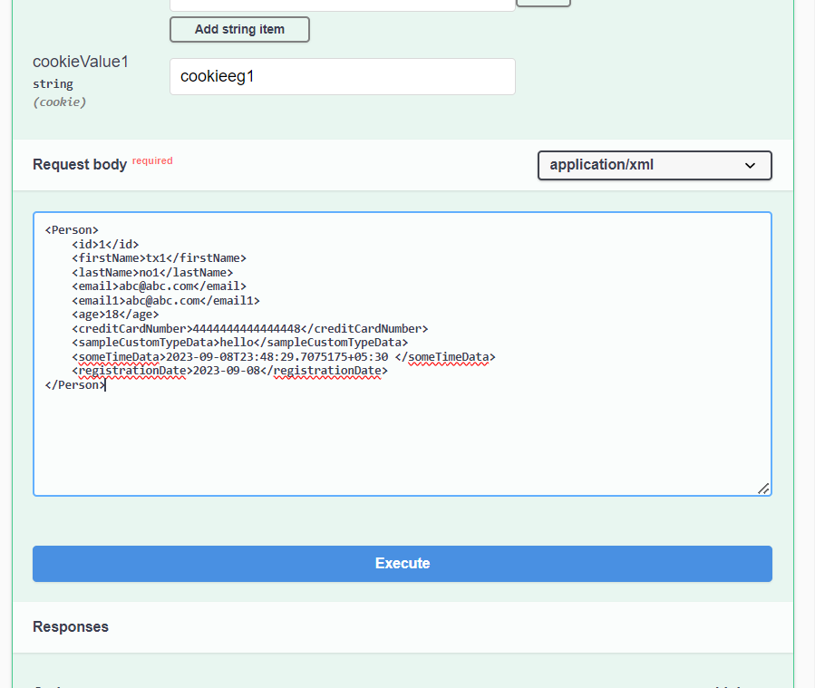
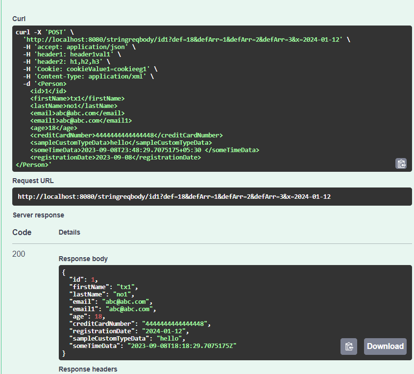
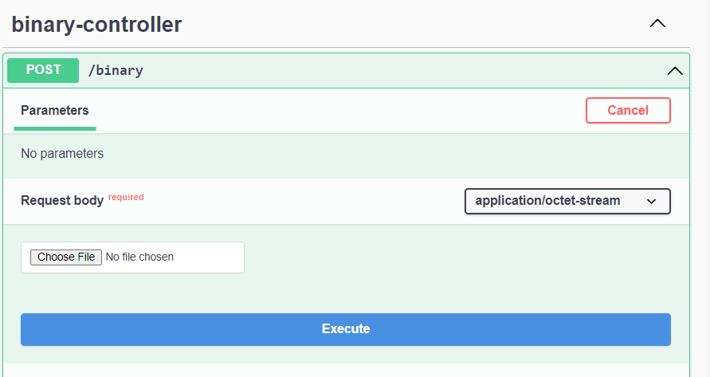
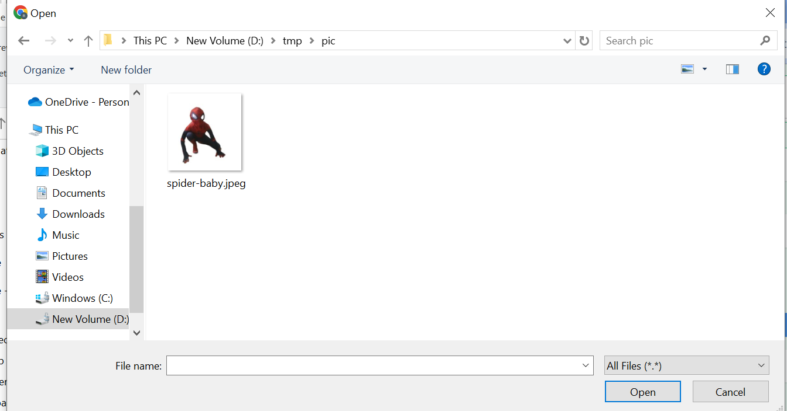
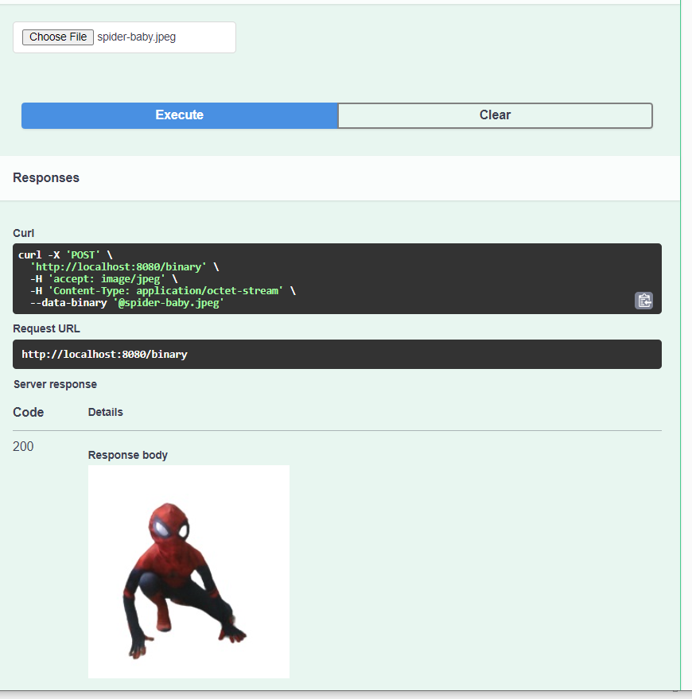

# 13-misc Demo #


Different media types are tried here.   
  


## Unusual Request Types ##

This is small proof of concept to demonstrate that if needed any request type can be handled.  Lets say we are able to handle requests that are of json,xml,form,multi-part when mapped to pojos. Also lets say we handle json, xml requests mapped to strings (as shown below).  Again lets say we also handle binary requests (as shown below). Tomorrow if there is a requirement to handle another previously unhandled type of request. If the requirement is clear and generic the library can be tweaked to handle any new requirement. 

### String as request body ###
This example also demonstrates parameter reuse. See 5-paramater-examples for more details regarding that.  

Press "Try out" after navigating to string-as-json-or-xml-controller
Showing a snippet the requests.  

  

Although the content type is json we have not mapped a bean for it and mapped just a string.  This example demostrates how to handle that.  

```json 

{
  "id": 1,
  "firstName": "tx1",
  "lastName": "no1",
  "email": "abc@abc.com",
  "email1": "abc@abc.com",
  "age": 18,
  "creditCardNumber": "4444444444444448",
  "sampleCustomTypeData": "hello",
  "someTimeData": "2023-09-08T23:48:29.7075175+05:30"
}

```

Copy the above json and replace with malformed json  in swagger-ui.   

   

Screen should look like above.  
 Press the blue "Execute" button to see below response.  

   

So that works for json requests mapped to Strings.

Note: While this works. Validations based on the schema wont work because schema was not referred to. The parameter validations would still work.   

If we try for xml lets see what happens.   

  

For now lets ignore the problem .

```xml 

<Person>
    <id>1</id>
    <firstName>tx1</firstName>
    <lastName>no1</lastName>
    <email>abc@abc.com</email>
    <email1>abc@abc.com</email1>
    <age>18</age>
    <creditCardNumber>4444444444444448</creditCardNumber>
    <sampleCustomTypeData>hello</sampleCustomTypeData>
    <someTimeData>2023-09-08T23:48:29.7075175+05:30 </someTimeData>
    <registrationDate>2023-09-08</registrationDate>
</Person>


```

Lets copy above xml and paste it.  

 

Press the blue button.  

 

Note: While this works. Validations based on the schema wont work because schema was not referred to. The parameter validations would still work.   

### application/octet-stream request ###

 

Press Choose file button.  
Navigate to a suitable compatible image file in jpeg. Even png may work.  

   

And below is the response.  

 


These are the main examples in this module.
Providing also postman requests for the same in the collection.
