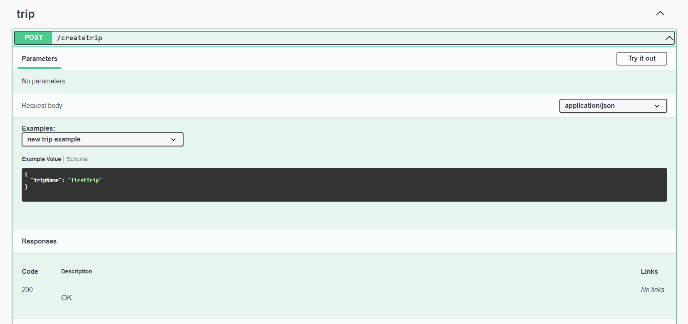
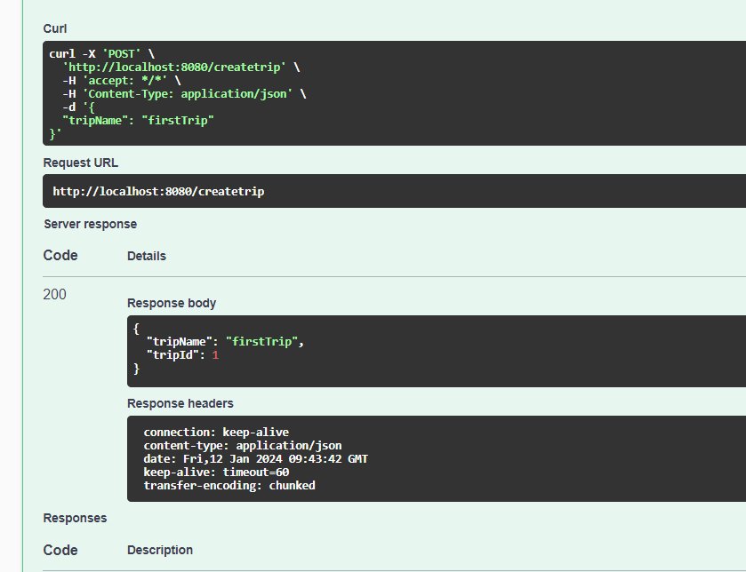
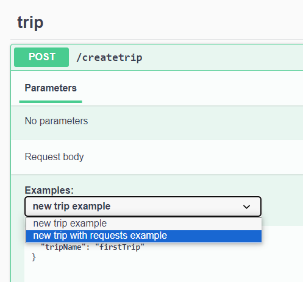
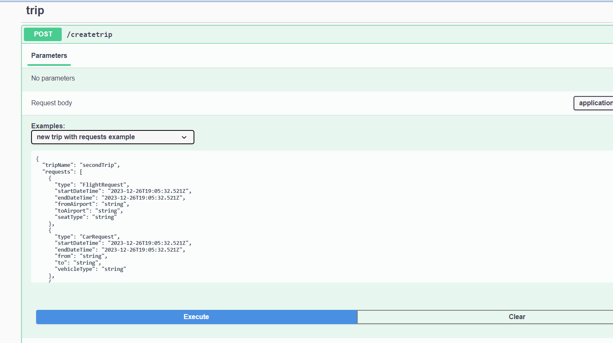
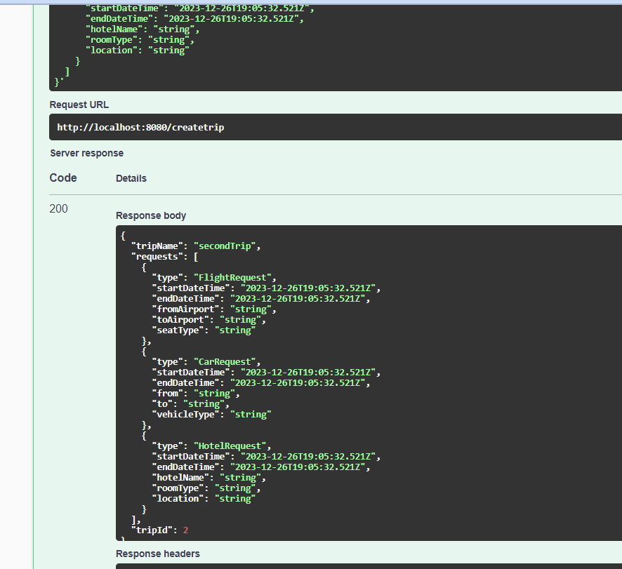
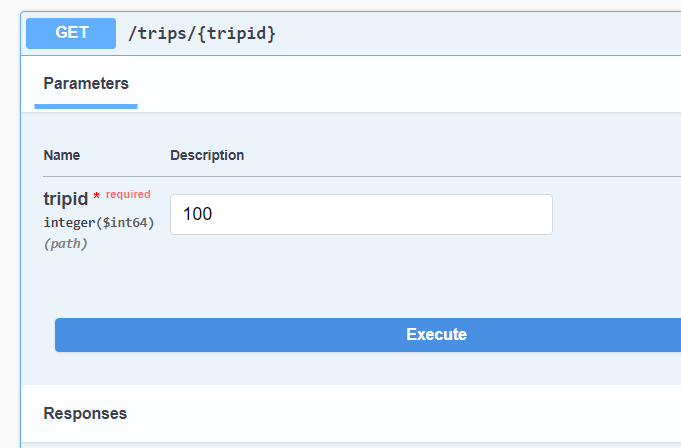
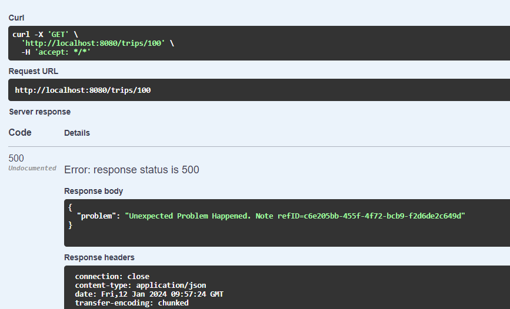
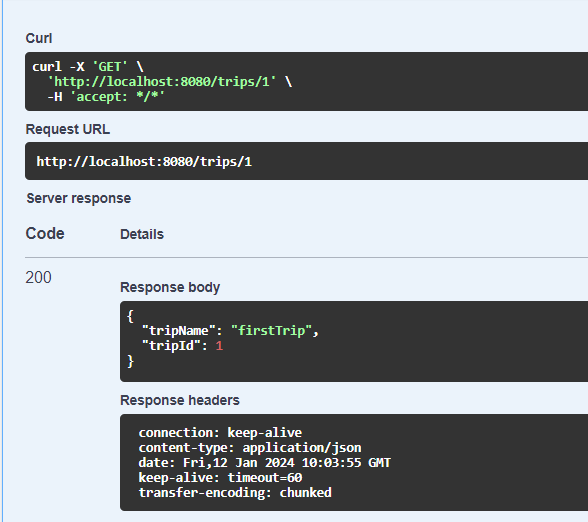
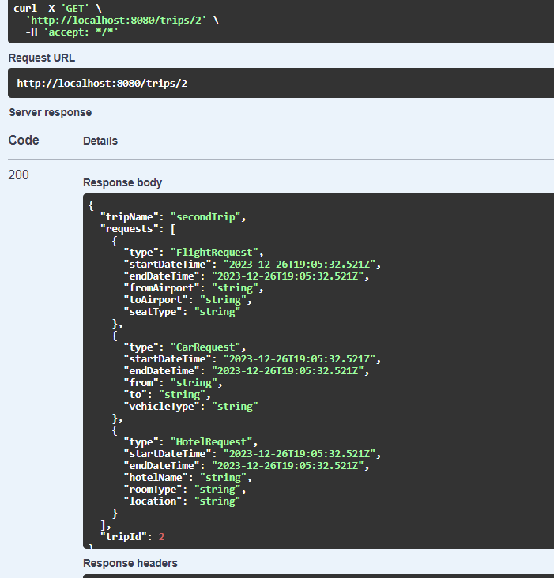

# 4-polymorphism-example Demo #

Referred to this.

https://swagger.io/docs/specification/data-models/inheritance-and-polymorphism/

Have supported discriminator/propertyName.

Yet to support discriminator/mapping.  (Its a WIP for now on my part)

Swagger-code-gen for spring has a hardcoding of discriminator/propertyName as "type".

Instead of relying on the generated @JsonTypeInfo because all information is also present in the swagger json/yaml. Might later try not depending on @JsonTypeInfo.  

Having said all this will proceed: 

   

Press "Try out". Press "Execute". 

   

This is one way of creating a trip.   
Lets create another trip in a different way.   

  

That looks like this.   

  

And response looks like the below.    
   

So far we have created two trips and the trip ids can be seen in the responsees.  

Lets try fetching a trip using a non existent trip id.   

   

Getting below response.  
   

In this example have chosen to not reveal the actual problem.  

We have seen in this example so far two trip ids of 1 and 2.

Lets try with them.

    

we get above for tripId of 1.  

    

we get above for tripId of 2.  

Lets now try the add request functionality.  

