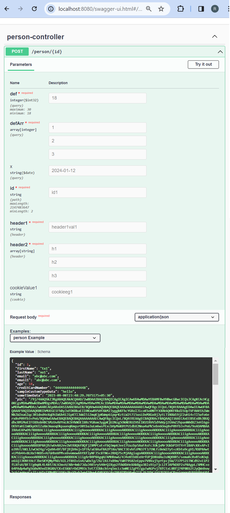

# 5-kitchen-sink Demo #


This is where variations of the parameter types are tried.  
Different media types are tried here.   
Unlike the previous example p[rojects, wont go into each example as of now. For now unlikely to be creating postman requests. There are two many examples here.  

Will demonstrate a few concepts.   

##Various Parameter types##

  

The above demonstrates parameters of path, query, header, cookie.   
Give it a try.  


##XDamah Parameter Wrappers##

In the post operation under "/person/{id}" we have this (Its only a very small section):

```json
{
	"tags": [
		"person-controller"
	],
	"operationId": "person",
	"x-damah": true,
	"x-damah-param-type": "PersonParam",
	"x-damah-service": "com.example.SampleService.doSomething(Person,PersonParam)",
	"parameters": [
		{
			"$ref": "#/components/parameters/def"
		},
		{
			"$ref": "#/components/parameters/id"
		},
		{
			"name": "header1",
			"in": "header",
			"required": true,
			"schema": {
				"type": "string",
				"example": "header1val1"
			}
		}
	]
}


```

"$ref": "#/components/parameters/def" is an example of how individual parameters are reused.  

Showing above a parameter of type header.   
Showing below how the reused parameters are dined under components.  

```json   

{
	"parameters": {
		"def": {
			"name": "def",
			"in": "query",
			"required": true,
			"schema": {
				"maximum": 30,
				"minimum": 18,
				"type": "integer",
				"format": "int32",
				"example": "18"
			}
		},
		"id": {
			"name": "id",
			"in": "path",
			"required": true,
			"schema": {
				"maxLength": 2147483647,
				"minLength": 2,
				"type": "string",
				"example": "id1"
			}
		}
	}
}


```
Look at the actual json to see how the other parameter types are declared.  


"x-damah-param-type": "PersonParam" - Here we specify the wrapper class to wrap the parameters in.  

See target/generated-sources/swagger/gen/java/com/example/model/PersonParam.java to have a look at the generated wrapper.  


##XDamah Parameter Reuse##

If same parameters recur in multiple oprations we can reuse the generated wrappers.

In the post operation under "/persona/{id}" we are reusing the wrapper defined earlier using x-damah-param-ref under "/person/{id}" post operation.       

"x-damah-param-ref": "PersonParam"   

Regarding the actual "parameters": [] array we can essentially repeat the same.   

We already seen how "$ref": "#/components/parameters/def" is an example individual parameters reuse.  

If that is still too tedious if using xdamah we can simply leave out the parameters. 

Have a look at "/personb/{id}" post operation to see how we can simply avoid repeating the parameters as long as XDamah is being used.   


 


