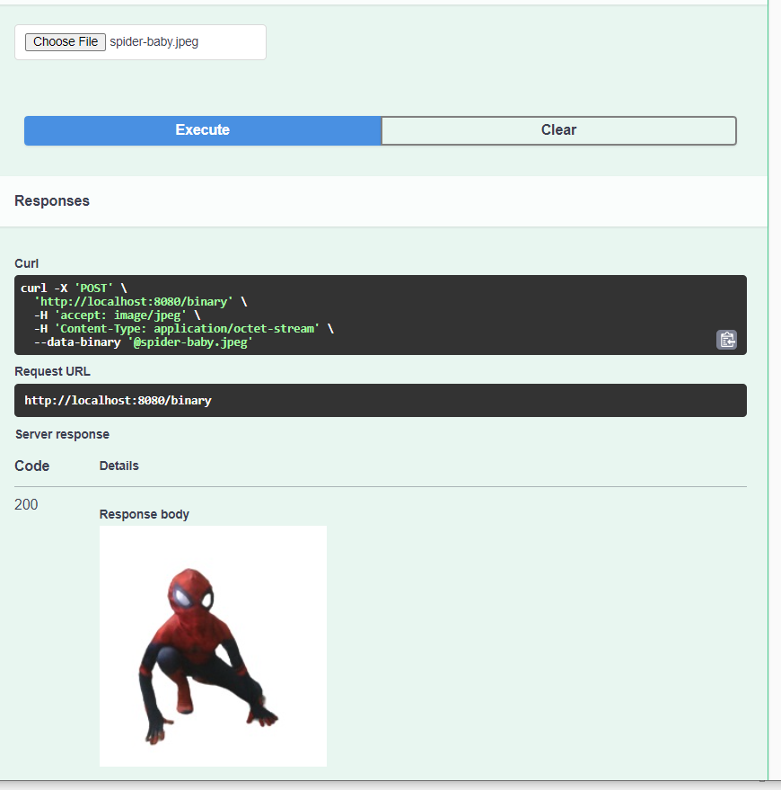

# 5-kitchen-sink Demo #


This is where variations of the parameter types are tried.  
Different media types are tried here.   
Unlike the previous example p[rojects, wont go into each example as of now. For now unlikely to be creating postman requests. There are two many examples here.  

Will demonstrate a few concepts.   

## Various Parameter types ##

  

The above demonstrates parameters of path, query, header, cookie.   
Give it a try.  


## XDamah Parameter Wrappers ##

In the post operation under "/person/{id}" we have this (Its only a very small section):

```json
{
	"tags": [
		"person-controller"
	],
	"operationId": "person",
	"x-damah": true,
	"x-damah-param-type": "PersonParam",
	"x-damah-service": "sampleService.doSomething(Person,PersonParam)",
	"parameters": [
		{
			"$ref": "#/components/parameters/def"
		},
		{
			"$ref": "#/components/parameters/id"
		},
		{
			"name": "header1",
			"in": "header",
			"required": true,
			"schema": {
				"type": "string",
				"example": "header1val1"
			}
		}
	]
}


```

"$ref": "#/components/parameters/def" is an example of how individual parameters are reused.  

Showing above a parameter of type header.   
Showing below how the reused parameters are dined under components.  

```json   

{
	"parameters": {
		"def": {
			"name": "def",
			"in": "query",
			"required": true,
			"schema": {
				"maximum": 30,
				"minimum": 18,
				"type": "integer",
				"format": "int32",
				"example": "18"
			}
		},
		"id": {
			"name": "id",
			"in": "path",
			"required": true,
			"schema": {
				"maxLength": 2147483647,
				"minLength": 2,
				"type": "string",
				"example": "id1"
			}
		}
	}
}


```
Look at the actual json to see how the other parameter types are declared.  


"x-damah-param-type": "PersonParam" - Here we specify the wrapper class to wrap the parameters in.  

See target/generated-sources/swagger/gen/java/com/example/model/PersonParam.java to have a look at the generated wrapper.  


## XDamah Parameter Reuse ##

If same parameters recur in multiple oprations we can reuse the generated wrappers.

In the post operation under "/persona/{id}" we are reusing the wrapper defined earlier using x-damah-param-ref under "/person/{id}" post operation.       

"x-damah-param-ref": "PersonParam"   

Regarding the actual "parameters": [] array we can essentially repeat the same.   

We already seen how "$ref": "#/components/parameters/def" is an example individual parameters reuse.  

If that is still too tedious if using xdamah we can simply leave out the parameters. 

Have a look at "/personb/{id}" post operation to see how we can simply avoid repeating the parameters as long as XDamah is being used.   


## Unusual Request Types ##

This is small proof of concept to demonstrate that if needed any request type can be handled.  Lets say we are able to handle requests that are of json,xml,form,multi-part when mapped to pojos. Also lets say we handle json, xml requests mapped to strings (as shown below).  Again lets say we also handle binary requests (as shown below). Tomorrow if there is a requirement to handle another previously unhandled type of request. If the requirement is clear and generic the library can be tweaked to handle any new requirement. 

### String as request body ###
Press "Try out" after navigating to string-as-json-or-xml-controller
Showing a snippet the requests.  

  

Although the content type is json we have not mapped a bean for it and mapped just a string.  This example demostrates how to handle that.  

```json 

{
  "id": 1,
  "firstName": "tx1",
  "lastName": "no1",
  "email": "abc@abc.com",
  "email1": "abc@abc.com",
  "age": 18,
  "creditCardNumber": "4444444444444448",
  "sampleCustomTypeData": "hello",
  "someTimeData": "2023-09-08T23:48:29.7075175+05:30"
}

```

Copy the above json and replace with malformed json  in swagger-ui.   

   

Screen should look like above.  
 Press the blue "Execute" button to see below response.  

   

So that works for json requests mapped to Strings.

Note: While this works. Validations based on the schema wont work because schema was not referred to. The parameter validations would still work.   

If we try for xml lets see what happens.   

  

For now lets ignore the problem .

```xml 

<Person>
    <id>1</id>
    <firstName>tx1</firstName>
    <lastName>no1</lastName>
    <email>abc@abc.com</email>
    <email1>abc@abc.com</email1>
    <age>18</age>
    <creditCardNumber>4444444444444448</creditCardNumber>
    <sampleCustomTypeData>hello</sampleCustomTypeData>
    <someTimeData>2023-09-08T23:48:29.7075175+05:30 </someTimeData>
    <registrationDate>2023-09-08</registrationDate>
</Person>


```

Lets copy above xml and paste it.  

 

Press the blue button.  

 


### application/octet-stream request ###

 

Press Choose file button.  
Navigate to a suitable compatible image file in jpeg. Even png may work.  

   

And below is the response.  

 
