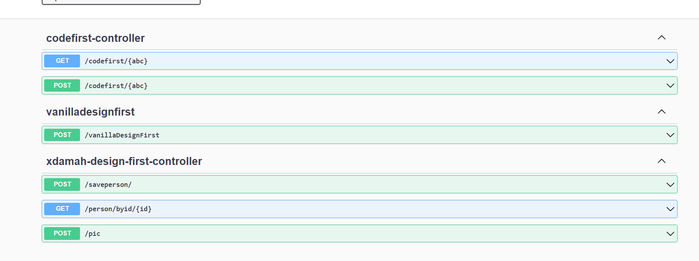

# 7-mixed Demo #

http://localhost:8080/swagger-ui.html   

Demonstrates 3 approaches co-existing in same project   
* code first
* design first
* xdamah  

In api-docs.json look for presence of x-damah=true/false or its absence.   

The xdamah section is quite similar to what's seen in [1-first-example](../1-first-example/README.md) 

Do try the examples using swagger-ui and postman.   
Use postman in case of requests of type application/x-www-form-urlencoded and multipart/form-data.   Read more about all this [here](../README.md) 

