# Swagger XDamah Examples #

This README documents whatever steps are necessary to get these example applications up and running.

### What is this repository for? ###

* This repository  demonstrates capabilities of  Swagger Xadamah - https://github.com/xdamah/swagger-xdamah

## Prerequisites ##
Below are the prerequisites I would recommend before getting into this
### General Prerequisites ###
* Knowledge of Spring Boot
* Knowledge and experience of Swagger - Code First and Design First


### Technical Prerequisites ###

* Java 17
* Maven latest

### Main Concept ###

Swagger can be used with two approaches.
* Code First
* Design First  


What we have here is a variation of design first approach.
Design first usually implies code generation. Not so in our approach- Lets call it xdamah. X stands for Swagger extensions. Damah means self control. It's a word play implying that The swagger specs itself does the control without a need for coding or code-generating a controller.

In this variation of Design first we have the following:
* We have the swagger specs as starting point.   
* We have two sub variations. We either have 0 code generation or code generation only for model classes.  What we don't have is the spring controllers.   
* We do have a spring extension which can makes writing/generating of controllers redundant at least for most use cases.  
* we also have automatic validation based on swagger specs.  

Before you say "Oh no not another OSS project" will like to add this is just a way of reducing code, getting things done, following some best practices by extending existing OSS frameworks.

Frameworks extended are:
* Spring-Boot
* Swagger
* Atlassian Request Validator


Lets quickly get started with.
### Quick start ###


### How do I get set up? ###


*Steps*  
* Run "git clone -b main https://github.com/xdamah/swagger-xdamah-examples.git"
* In the project folder run "mvn clean package".
* That should build all the example projects.
* Each project builds into a jar file - target/demo.jar   
* In each project cd [example project name]
* for example cd main-examples\basic\basic-no-controller    
* then run from comamnd prompt "java -jar target/demo.jar"
* When that finishes launching we should run http://localhost:8080/swagger-ui.html  
* Will be able to follow along using swagger ui.   
* Where needed will also refer to [postman collection](swagger-xdamah-postman-collection.json)  for same.  Do import the postman collection and try where needed.  (The postman collection- Might be getting a bit out of synch as f now) 
* More details in each project folder's Readme.MD.

### Whats in the examples? ###

The examples are organized into two folders   
* main-examples
* more-examples

Will discuss the main examples here first and understand what that is about.  
The main-examples are illustrated with 2 use cases- basic and with-poly(morphism).  
In each we have two options -no-controller and -modelgen-and-no-controller  

So we basically have 6 projects of interest here in the main examples.  
* swagger-xdamah-examples\main-examples\basic\basic-no-controller
* swagger-xdamah-examples\main-examples\basic\basic-modelgen-and-no-controller
* swagger-xdamah-examples\main-examples\extend\extend-no-controller
* swagger-xdamah-examples\main-examples\extend\extend-modelgen-and-no-controller
* swagger-xdamah-examples\main-examples\polymorphic\polymorphic-no-controller
* swagger-xdamah-examples\main-examples\polymorphic\polymorphic-modelgen-and-no-controller

While these projects are organized in a tree structure to avoid repeating same pom.xml maven details - example - dependencies and plugins there is no reason why each cannot be implemented as a stand alone maven project.  

Each example here will be described in main-examples\README.md   

However for a very quick introduction will discuss the examples under "main-examples\basic" here.  

#### Walkthru ####
[](README.md#Walkthru)[](README-main-basic-modelgen.md#Walkthru)

Lets start with main-examples\basic\basic-no-controller and then will discuss main-examples\basic\basic-modelgen-and-no-controller.  

main-examples\basic\basic-no-controller:
This is a very regular spring-boot project by itself.  

The only unusual dependencies which you can find in this project by means of the parent pom.xmls is
```xml
<dependency>
	<groupId>io.github.xdamah</groupId>
	<artifactId>xdamah-lib</artifactId>
	<version>${xdamah-version}</version>
</dependency>
```		
and
```xml
<dependency>
	<groupId>com.atlassian.oai</groupId>
	<artifactId>swagger-request-validator-spring-webmvc</artifactId>
	<version>2.37.0</version>
</dependency>
```		
Now lets discuss the code:  

```java
@SpringBootApplication(
scanBasePackages = { "io.github.xdamah", "com.example" })
public class BasicNoControllerApplication {
	private static final Logger logger = LoggerFactory.getLogger(BasicNoControllerApplication.class);

	public static void main(String[] args) {
		SpringApplication.run(BasicNoControllerApplication.class, args);
	}

	@PostConstruct
	void adjustModelConverters() {
		TypeNameResolver.std.setUseFqn(true);
		ModelConverters.getInstance().addConverter(new ByteArrayPropertyConverter());

	}

}
```	

Next showing a snippet of the model class.   
```java
public class Person {

	private Long id = null;

	@NotNull
	@NotBlank
	@Size(min = 2, max = 20, message = "firstname has size limits")
	private String firstName = null;

	@NotNull
	@NotBlank
	@Size(min = 2)
	private String lastName = null;

	@Pattern(regexp = ".+@.+\\..+", message = "Please provide a valid email address")
	private String email;

	@Min(18)
	@Max(30)
	private Integer age;

	private LocalDate registrationDate = null;

	private byte[] pic = null;

	private List<byte[]> pics = null;

	private OffsetDateTime someTimeData = null;

	private Person anotherPerson = null;

	private List<Person> children = null;
	//ommitting getters and setters
}	
```	

Now showing snippet of service class.   

```java
@Service
public class SampleService {

	public Person savePerson(Person person) {
		return person;
	}

	public Resource pic(Person person) {
		ByteArrayResource resource = new ByteArrayResource(person.getPic());
		return resource;
	}

	public Resource binary(byte[] bytes) {
		ByteArrayResource resource = new ByteArrayResource(bytes);
		return resource;
	}

	public Person byid(long id) {
		Person person = new Person();
		person.setId(id);
		person.setFirstName("F");
		person.setLastName("L");
		person.setRegistrationDate(LocalDate.of(2024, 1, 1));
		person.setSomeTimeData(OffsetDateTime.of(2024, 1, 1, 0, 0, 0, 0, ZoneOffset.ofHours(0)));
		return person;
	}

}

```	

There is one more code. 

[Modified Atlassian RequestBodyValidator](main-examples/basic/basic-no-controller/src/main/java/com/atlassian/oai/validator/interaction/request/RequestBodyValidator.java)

But its really just a means of extending the Atlassian validation components by overwriting that one class. In future it is hoped this can be done in a cleaner manner.  

Thats all the code we write.  
We do not have to write the Rest controller.
We do not write it in this example because all the information that we code in the rest controller is present in the swagger specs and its extension.


Please see [swagger specifications](main-examples/basic/basic-no-controller/api-docs.json).

Lets discuss it a little.

Under "paths" we have briefly below structure (Omitting many details here for brevity).
    
```json
"paths": {
		"/saveperson/": {
			"post": {
				"tags": [
					"person-controller"
				],
				"operationId": "person",
				"x-damah-service": "sampleService.savePerson(com.example.model.Person)"
			}
		},
		"/person/byid/{id}": {
			"get": {
				"tags": [
					"person-controller"
				],
				"operationId": "personbyid",
				"x-damah-service": "sampleService.byid(long)"
			}
		},
		"/pic": {
			"post": {
				"tags": [
					"person-controller"
				],
				"operationId": "person-pic",
				"x-damah-service": "sampleService.pic(com.example.model.Person)"

			}
		}

	}
```	
We see here that the swagger specs is a regular specifications file which uses a x-damah-service to indicate the service bean method that will be invoked by the endpoint.

Thats one concept.  
We saw how the model class was written along-with the service class. We can manually repeat the model class definitions in the "components/schemas" of the swagger-specifications.

Alternatively we can do this:
    
```json
"components": {
	"schemas": {
		"x-damah-models": ["com.example.model.Person"]
		
	}
}
```	
At runtime we are expecting this to be converted into the proper schema definitions of the model class.   We will show that in a very short while.  

Lets try this out and see:

Visit http://localhost:8080/swagger-ui.html 
 
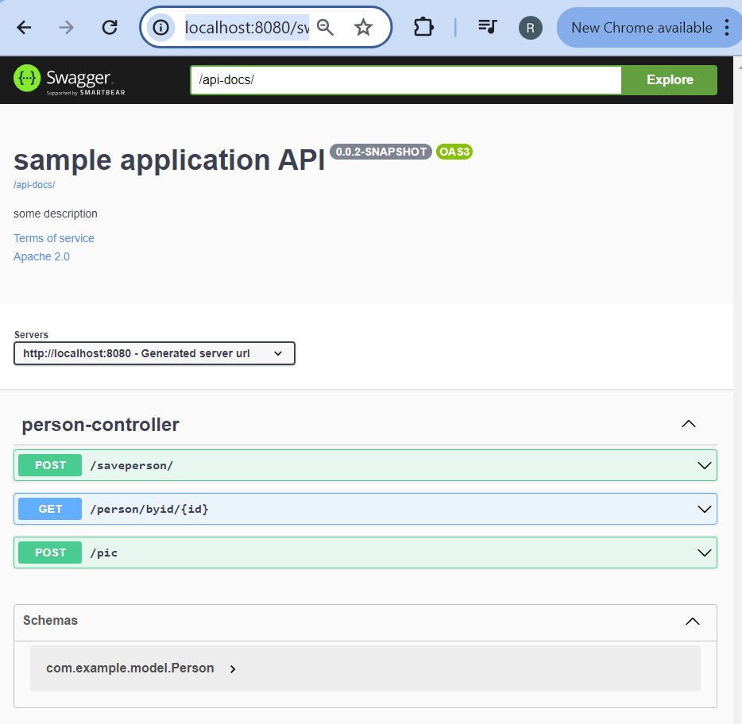  

Lets visit http://localhost:8080/api-docs/ and scroll down. 

```json  
"schemas": {
			"com.example.model.Person": {
				"properties": {
					"id": {
						"type": "integer",
						"format": "int64"
					},
					"firstName": {
						"type": "string",
						"maxLength": 20,
						"minLength": 2
					},
					"lastName": {
						"type": "string",
						"maxLength": 2147483647,
						"minLength": 2
					},
					"email": {
						"type": "string",
						"pattern": ".+@.+\\..+"
					},
					"age": {
						"type": "integer",
						"format": "int32",
						"maximum": 30,
						"minimum": 18
					},
					"registrationDate": {
						"type": "string",
						"format": "date"
					},
					"pic": {
						"type": "string",
						"format": "byte"
					},
					"pics": {
						"type": "array",
						"items": {
							"type": "string",
							"format": "byte"
						}
					},
					"someTimeData": {
						"type": "string",
						"format": "date-time"
					},
					"anotherPerson": {
						"$ref": "#/components/schemas/com.example.model.Person"
					},
					"children": {
						"type": "array",
						"items": {
							"$ref": "#/components/schemas/com.example.model.Person"
						}
					}
				},
				"required": [
					"firstName",
					"lastName"
				]
			}
		}

```	
The above shows the result of "x-damah-models": ["com.example.model.Person"] in the actual swagger specifications.  

Expanding the person schema in swagger ui and showing the details

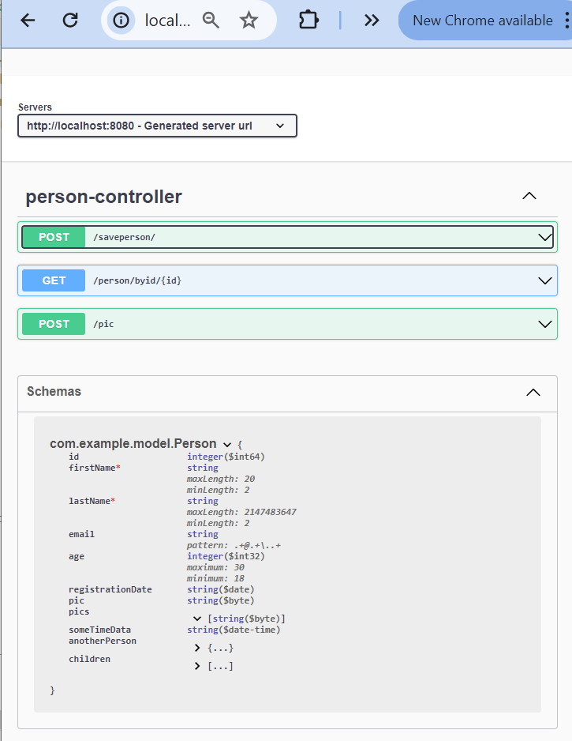  

Lets expand Post>save person. Lets click the "Try it out" button.  

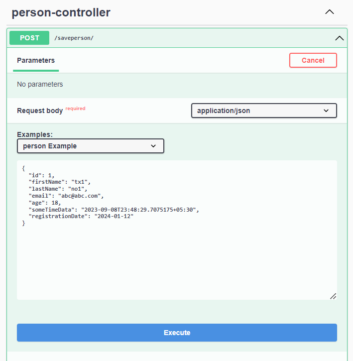 
For all other details of main examples please see main-examples\README.md.    

Press Execute button.  
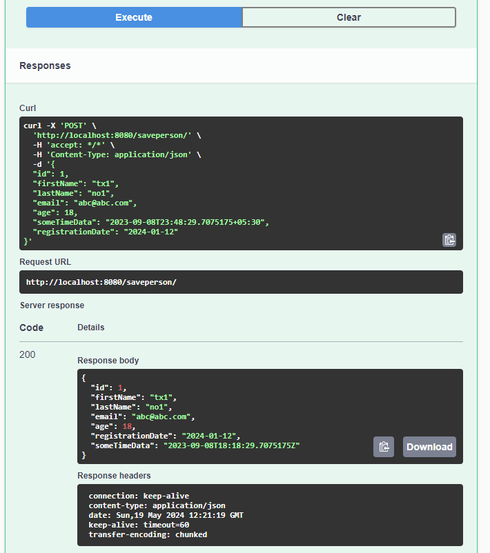 

Last time we submitted this:  

```json  
{
  "id": 1,
  "firstName": "tx1",
  "lastName": "no1",
  "email": "abc@abc.com",
  "age": 18,
  "someTimeData": "2023-09-08T23:48:29.7075175+05:30",
  "registrationDate": "2024-01-12"
}
```	  

Lets submit this again after changing the input to:  

```json  
{
  "id": 1,
  "lastName": "n",
  "email": "abcabc.com",
  "age": 17,
  "someTimeData": "2023-09-08T23:48:29.7075175+05:30",
  "registrationDate": "2024-01-12"
}
```	  

Changes are: 
- we removed the firstName, 
- changed value of lastName to have 1 character, 
- removed @ from email, 
- reduced age to 17.  

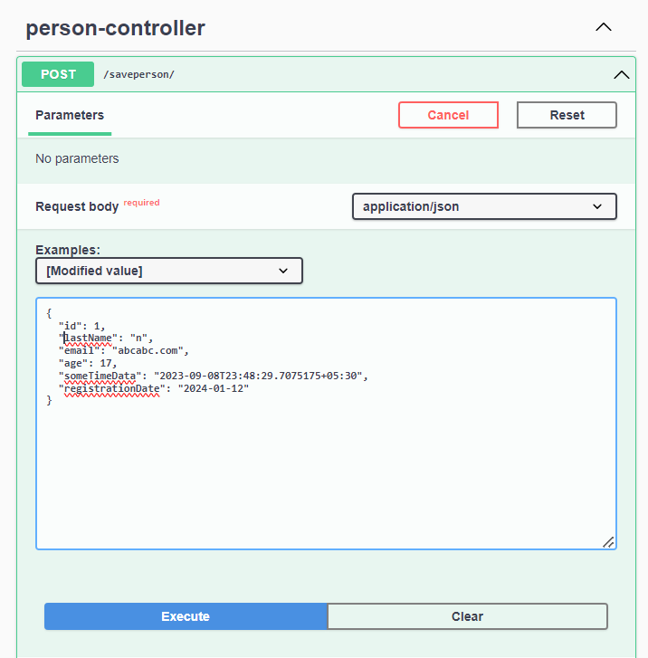 

Press Execute button.  
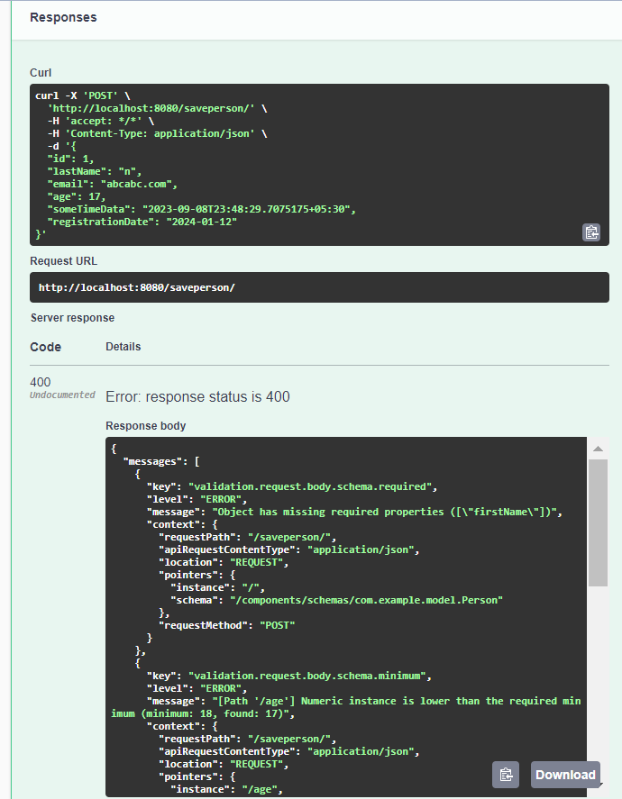 

Listing below the errors:
```json    
{
  "messages": [
    {
      "key": "validation.request.body.schema.required",
      "level": "ERROR",
      "message": "Object has missing required properties ([\"firstName\"])",
      "context": {
        "requestPath": "/saveperson/",
        "apiRequestContentType": "application/json",
        "location": "REQUEST",
        "pointers": {
          "instance": "/",
          "schema": "/components/schemas/com.example.model.Person"
        },
        "requestMethod": "POST"
      }
    },
    {
      "key": "validation.request.body.schema.minimum",
      "level": "ERROR",
      "message": "[Path '/age'] Numeric instance is lower than the required minimum (minimum: 18, found: 17)",
      "context": {
        "requestPath": "/saveperson/",
        "apiRequestContentType": "application/json",
        "location": "REQUEST",
        "pointers": {
          "instance": "/age",
          "schema": "/components/schemas/com.example.model.Person/properties/age"
        },
        "requestMethod": "POST"
      }
    },
    {
      "key": "validation.request.body.schema.pattern",
      "level": "ERROR",
      "message": "[Path '/email'] ECMA 262 regex \".+@.+\\..+\" does not match input string \"abcabc.com\"",
      "context": {
        "requestPath": "/saveperson/",
        "apiRequestContentType": "application/json",
        "location": "REQUEST",
        "pointers": {
          "instance": "/email",
          "schema": "/components/schemas/com.example.model.Person/properties/email"
        },
        "requestMethod": "POST"
      }
    },
    {
      "key": "validation.request.body.schema.minLength",
      "level": "ERROR",
      "message": "[Path '/lastName'] String \"n\" is too short (length: 1, required minimum: 2)",
      "context": {
        "requestPath": "/saveperson/",
        "apiRequestContentType": "application/json",
        "location": "REQUEST",
        "pointers": {
          "instance": "/lastName",
          "schema": "/components/schemas/com.example.model.Person/properties/lastName"
        },
        "requestMethod": "POST"
      }
    }
  ]
}
```	  
Now 

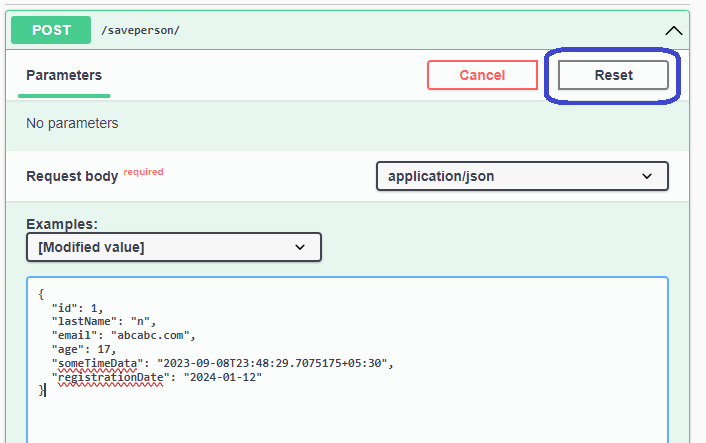 

Press the above reset button.
Pressing the reset button should undo the manual modifications to the input.  

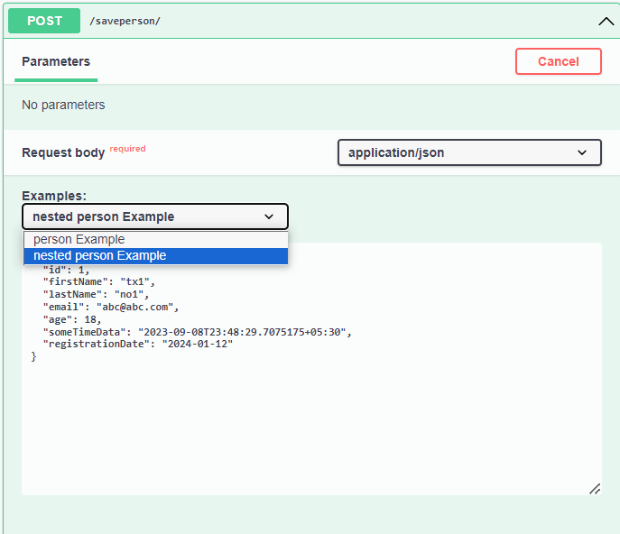 

We can also try the "nested Person Example".   
It will bring in a more complex model data.  

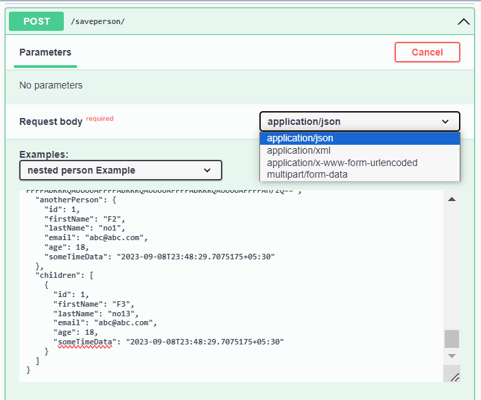 

We can also try the other media types as shown above.  

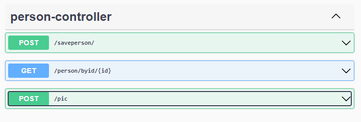 

With this we have had a quick look at the first of the 3 endpoints shown here.  

The second endpoint should be straightforward. It uses a service method that returns an almost hardcoded data.  

The third endpoint is slightly contrived but just to show some other aspects.  

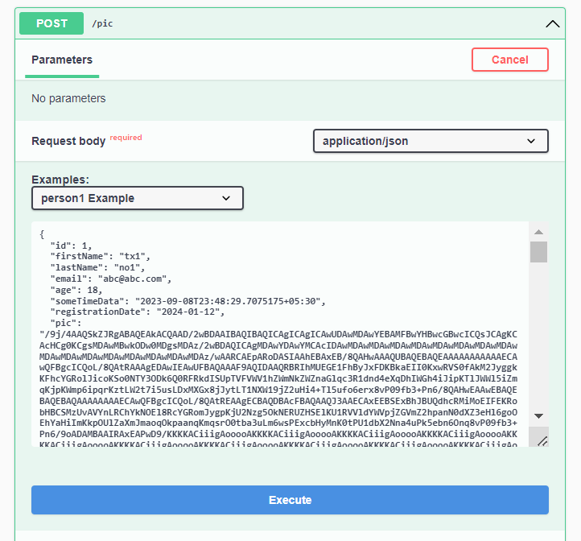  

Thats the request.

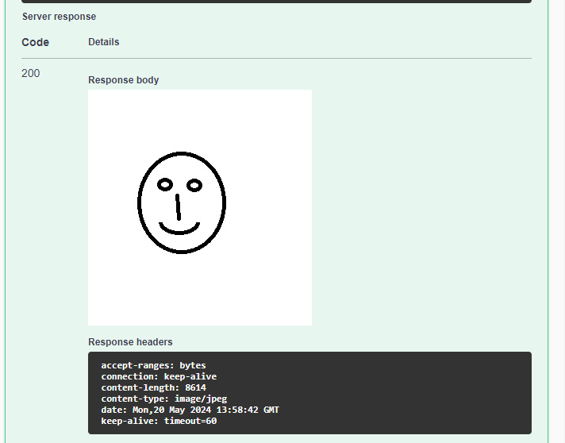

Thats the response.

Please try the other main-examples.   

If interested can go into more-examples folder later to understand what other features are also there for a more complete picture.


