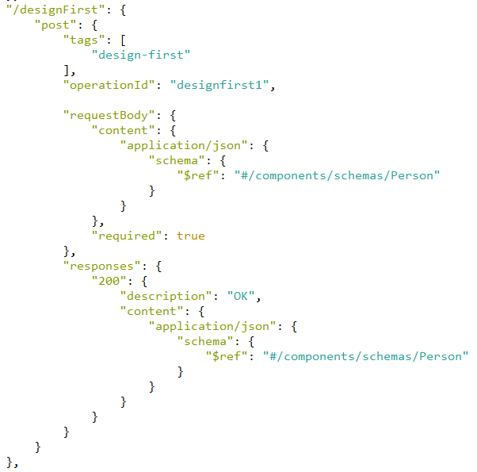

# Swagger Xadamah Examples #

This README documents whatever steps are necessary to get these example applications up and running.

### What is this repository for? ###

* This repository  demonstrates capabilities of  Swagger Xadamah - https://github.com/xdamah/swagger-xdamah

### Main Concept ###

Swagger can be used with two approaches.
* Code First
* Design First  

Often in code first we write code of this type.

Then we generate swagger documents from this code.  

Not showing here the validation constraints and other best practices like Controller Advice usage for exception handling.  

Similarly in design first we write  swagger specifications similar to the below   


Then we generate code from the specifications.

Again not showing here details of validation constraints.

Will see more details in that regard later.   
If we look carefully and obviously we will see that the swagger specifications- hand written or generated or for that matter the controller code hand written or generated are the API contract. They both specify the same things - 
* the url path.
* the validation constraints
* the media types for the request and response

It will not be incorrect to say that they both are request/response rules for request/response processing expressed in json/yaml or code.  

The main goal is to express, enforce those rules and invoke the business logic.

What we have here is a variation of design first approach.
Obviously design first implies code generation. 

If we see the code each controller code will look very similar to another controller code. The only difference will be in the service method invoked.  What we are trying to avoid here is generating the controller and related code. The rules for that purpose including that of validations are already there in the swagger specs in json/yaml. 

Instead of generating the controller code which mirrors the rules specified in the swagger specs is it possible to invoke apply those same rules leveraging whats specified in the swagger specs as source of truth for the rules and also achieve invoking of the service class method?  

The only code that is generated is that of the model POJO classes.  

So that's the objective.   


### How do I get set up? ###

* Temporary Dependency
* Prerequisites
* Steps


*Temporary Dependency*   

* clone https://github.com/xdamah/swagger-xdamah
* In the project folder run "mvn clean install".
* Once this is deployed into maven central this step wont be needed. 

*Prerequisites*  
* JDK 18
* Latest Maven

*Steps*  
* clone https://github.com/xdamah/swagger-xdamah-examples
* In the project folder run "mvn clean package".
* That should build all the example projects.
* Each project builds into a jar file - target/demo.jar   
* In each project cd [example project name]
* for example cd 1-first-example
* then run from comamnd prompt "java -jar target/demo.jar"
* When that finishes launching we should run http://localhost:8080/swagger-ui.html  
* Will be able to follow along using swagger ui.   
* Where needed will also refer to postman collection for same.  
* More details in each project folder's Readme.MD.

### Whats in the examples? ###

| The Examples            | Description                                            | Link                              |        
| :---------------------- | :----------------------------------------------------- |:--------------------------------- |   
| 1-first-example         | A quick introductory demo                              | [link](1-first-example/README.md) |   
| 2-with-security         | A demo with spring security                            | [link](2-with-security)           |
| 3-mixed                 | Mixed use of xdamah, code first, vanilla design first  | [link](3-mixed)                   |
| 4-polymorphism-example  | A demo of Polymorphism in request and response POJO    | [link](4-polymorphism-example)    |
| 5-kitchen-sink          | A bit cluttered but more detailed test of the concept  | [link](5-kitchen-sink)            |

### More Details ###
We have these swagger extensions examples of which are shown below.

"x-damah": true,   
"x-damah-service": "sampleService.doSomething(Person)".   

These swagger extensions can be applied to any of the operations in the swagger json adjacent to the operationId.  

Here by "x-damah": true we are saying we want to use this concept that we have been discussing.  
Using "x-damah": true or specifying "x-damah-service" bean name and method is enough to enable this.  

"x-damah-service" specifies post validation which is the service bean method that must be invoked.

*What happens if we dont specify x-damah related attributes?*  
It will trigger regular design first code generation and use for that operation
Please see 3-mixed example for more information.

*What happens if we just specify x-damah=false ?*  
It will prevent code generation  for that operation.
Needless the developer must write the code in code first style and match the specs.
Please see 3-mixed example for more information.

*What about parameters?*  

Before discussing that lets be on same page with https://swagger.io/docs/specification/describing-request-body/   

"Unlike OpenAPI 2.0, where the request body was defined using body and formData parameters, OpenAPI 3.0 uses the requestBody keyword to distinguish the payload from parameters (such as query string). The requestBody is more flexible in that it lets you consume different media types, such as JSON, XML, form data, plain text, and others."

Naturaly it makes sense to map the request body irerspective of media types to POJOS or java beans generally speaking.

https://swagger.io/docs/specification/describing-parameters/

It is intended that all the parameter types as described in above url are supported when xdamah is enabled.  

However when using xdamah there are some additional concepts for these parameters.  

* Whenever there are more than one parameters mentioned for an operation the parameters are wrapped into a POJO. 
* If there is only one parameter for an operation its used as it is.  
* "x-damah-param-type": "PersonParam" - use this syntax to specify the name of the POJO to generate which wraps the parameters.
* If the same parameters are being used in different operations rather than generate another POJO can also leverage  this syntax- "x-damah-param-ref": "PersonParam"  


*What about Service methods?*  
* Service methods are written in same way as we would usually.  
* However a xdamah combatible service method will have at most 2 arguments.  
Listing below some examples.

| Service bean method examples                                   | Description                                                    |    
| :-------------------------------------------------------- | :------------------------------------------------------------- |   
| sampleService.savePerson(Person)              | Person is from RequestBody                                     |  
| sampleService.byid(long)                      | No request body just a single long type parameter              |   
| sampleService.doSomething(Person,PersonParam) | Person is from RequestBody, PersonParam is the parameter POJO  |   
| sampleService.doSomethingElse(Person,long)    | Person is from RequestBody, single long type parameter         | 

 


What if I need to access something not specified in the parameters or request body as defined in the swagger specifications?
* One can use below approach which is certainly neater than passing the request object to a service method in any case. Keep in mind while we are referring to this as a service class it could also be any Spring Bean. 

```java
@Autowired
private HttpServletRequest request;

```

### What is known  WIP ###

a) Initially was coding the validations using custom code entirely. Later thought it better to reuse https://bitbucket.org/atlassian/swagger-request-validator/  Have been working around some of its current limitations.  
For example- For json meadiatype there is good validation support.  
Have added support for xml media type requests to be validated using just swagger specifications by extending its behaviour.  This can be done in multiple ways. Used a valid quick approach for now.  
Have more thoughts on how it can be taken further.  
For the other mediatypes this is WIP on my part. If this goes well overall can put effort in that direction.    


b) Am currently working with Swagger 3.0. The external swagger examples - are being merged in to the final swagger specifications as part of a value add in this library. Once this is upgraded to Swagger 3.1 this extra programmatic feature  wont be needed because 3.1 is supposed to take care of that.  


c) In the example projects also demonstrate form and multi-part form submission. This gets interesting especially when the forms have nested models and nested array type models. This is working. There is however room for making this a bit more flexible. Eg - should "." be used to traverse to a nested bean. What about for eg "/", Similarly more variations on how to identify indexing. Can be done. 

Am sure there are more limitations/WIPs. Hope to improve as they are seen.


### Any thing extra that is available here and not elsewhere? ###


There are a few different concepts here.
1. Not generating the controller code.  
2. Generating only the model code.  
3. If Parameters are more than one in number wrapping them into a java bean.  
4. Mixing code-first, design first and xdamah.  
5. Reuse of parameter definitions. (Pretty minor but can be handy) 


But there is one more interesting feature.   
A. **For the same model its much easier to support requests in multiple media types - json, xml, form, multipart as swagger request body compared to regular spring approaches.  In 1-first-example this is also demonstrated and discussed more**.   


### Also ###
- Demonstrates custom types.  
- Demonstrates custom validation.  


### TODOs ###

1. Upgrade the spring version.   
2. Upgrade the generator versions.   
3. Upgrade from swagger 3.0 to 3.1. 
3. Add Unit Tests for the examples projects.  
4. Work on the WIPs mentioned earlier.  


