[](../../../README.md)
[](../basic-no-controller/README.md)
[](README.md)

# basic-modelgen-and-no-controller #

main-examples\basic\basic-modelgen-and-no-controller:
This is not a very regular spring-boot swagger codegen project by itself.  

It uses a xdamah-maven-codegen-plugin for generating the model code.  
This swagger code generation plugin extends the usual swagger-codegen-maven-plugin. 

Otherwise the only unusual dependencies which you can find in this project by means of the parent pom.xmls is
```xml
<dependency>
	<groupId>io.github.xdamah</groupId>
	<artifactId>xdamah-lib</artifactId>
	<version>${xdamah-version}</version>
</dependency>
```		
and
```xml
<dependency>
	<groupId>com.atlassian.oai</groupId>
	<artifactId>swagger-request-validator-spring-webmvc</artifactId>
</dependency>
```		
Now lets discuss the code:  

```java
@SpringBootApplication(scanBasePackages = { "io.github.xdamah", "com.example" })
public class BasicModelGenAndNoControllerApplication {
	
	public static void main(String[] args) {

		SpringApplication.run(BasicModelGenAndNoControllerApplication.class, args);
			
	}

}


```	

Now showing snippet of service class.   

```java
@Service
public class SampleService {

	public Person savePerson(Person person) {
		return person;
	}

	public Resource pic(Person person) {
		ByteArrayResource resource = new ByteArrayResource(person.getPic());

		return resource;
	}

	public Person byid(long id) {
		Person person = new Person();
		person.setId(id);
		person.setFirstName("F");
		person.setLastName("L");
		person.setRegistrationDate(LocalDate.of(2024, 1, 1));
		person.setSomeTimeData(OffsetDateTime.of(2024, 1, 1, 0, 0, 0, 0, ZoneOffset.ofHours(0)));
		return person;
	}

}

```	

There is one more code. 

[Modified Atlassian RequestBodyValidator](src/main/java/com/atlassian/oai/validator/interaction/request/RequestBodyValidator.java)

But its really just a means of extending the Atlassian validation components by overwriting that one class. In future it is hoped this can be done in a cleaner manner.  

Thats all the code we write.  
We do not have to generate the Rest controller.
We do not generate it in this example because all the information that we code in the rest controller is present in the swagger specs and its extension.


Please see [swagger specifications](api-docs.json).

Lets discuss it a little.

Under "paths" we have briefly below structure (Omitting many details here for brevity).
    
```json
"paths": {
		"/saveperson/": {
			"post": {
				"tags": [
					"person-controller"
				],
				"operationId": "person",
				"x-damah-service": "sampleService.savePerson(com.example.model.Person)"
			}
		},
		"/person/byid/{id}": {
			"get": {
				"tags": [
					"person-controller"
				],
				"operationId": "personbyid",
				"x-damah-service": "sampleService.byid(long)"
			}
		},
		"/pic": {
			"post": {
				"tags": [
					"person-controller"
				],
				"operationId": "person-pic",
				"x-damah-service": "sampleService.pic(com.example.model.Person)"

			}
		}

	}
```	
We see here that the swagger specs is a regular specifications file which uses a x-damah-service to indicate the service bean method that will be invoked by the endpoint.

Thats one concept.  
The model class used by the service class is generated based on "components/schemas" of the swagger-specifications.

Namely:
    
```json
"components": {
	"schemas": {
		"com.example.model.Person": {
			"required": [
				"lastName"
			],
			"type": "object",
			"properties": {
				"id": {
					"type": "integer",
					"format": "int64"
				},
				"firstName": {
					"maxLength": 2147483647,
					"minLength": 2,
					"type": "string"
				},
				"lastName": {
					"type": "string"
				},
				"email": {
					"pattern": ".+@.+\\..+",
					"type": "string"
				},
				"age": {
					"maximum": 30,
					"minimum": 18,
					"type": "integer",
					"format": "int32"
				},
				"registrationDate": {
					"type": "string",
					"format": "date"
				},
				"pic": {
					"type": "string",
					"format": "byte"
				},
				"pics": {
					"type": "array",
					"items": {
						"type": "string",
						"format": "byte"
					}
				},
				"someTimeData": {
					"type": "string",
					"format": "date-time"
				},
				"anotherPerson": {
					"$ref": "#/components/schemas/com.example.model.Person"
				},
				"children": {
					"type": "array",
					"items": {
						"$ref": "#/components/schemas/com.example.model.Person"
					}
				}
			},
			"xml": {
				"name": "person"
			}
		}
	}
}
```	


Lets try this out and see:

Visit http://localhost:8080/swagger-ui.html 
 
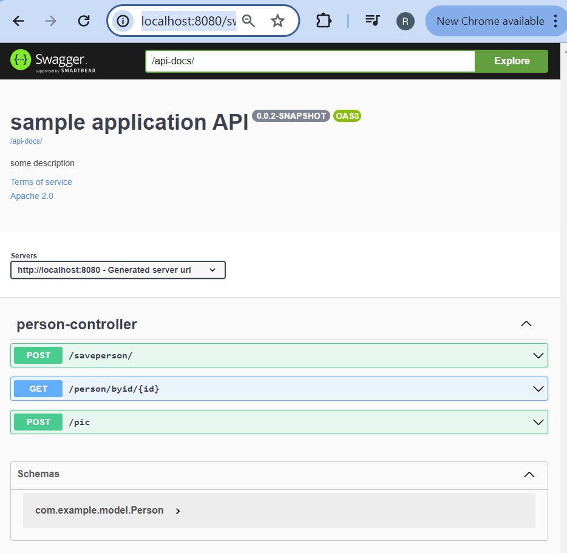  


Lets expand Post>save person. Lets click the "Try it out" button.  

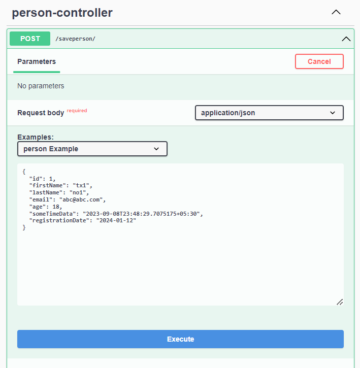 

Press Execute button.  
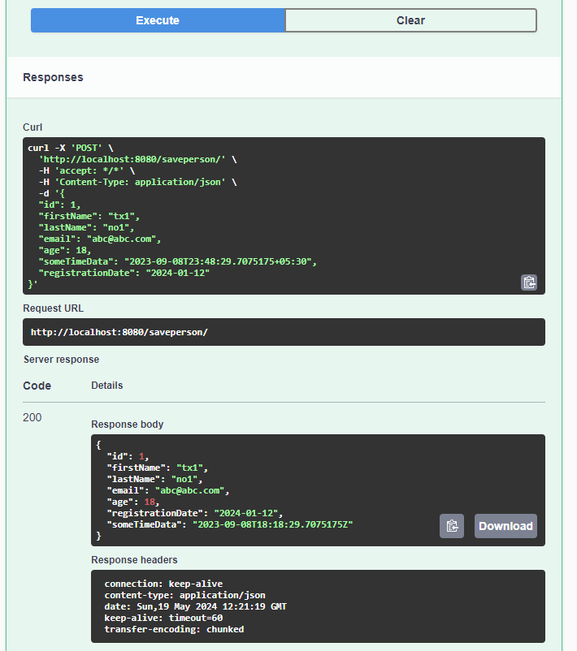 

Last time we submitted this:  

```json  
{
  "id": 1,
  "firstName": "tx1",
  "lastName": "no1",
  "email": "abc@abc.com",
  "age": 18,
  "someTimeData": "2023-09-08T23:48:29.7075175+05:30",
  "registrationDate": "2024-01-12"
}
```	  

Lets submit this again after changing the input to:  

```json  
{
  "id": 1,
  "lastName": "n",
  "email": "abcabc.com",
  "age": 17,
  "someTimeData": "2023-09-08T23:48:29.7075175+05:30",
  "registrationDate": "2024-01-12"
}
```	  

Changes are: 
- we removed the firstName, 
- changed value of lastName to have 1 character, 
- removed @ from email, 
- reduced age to 17.  

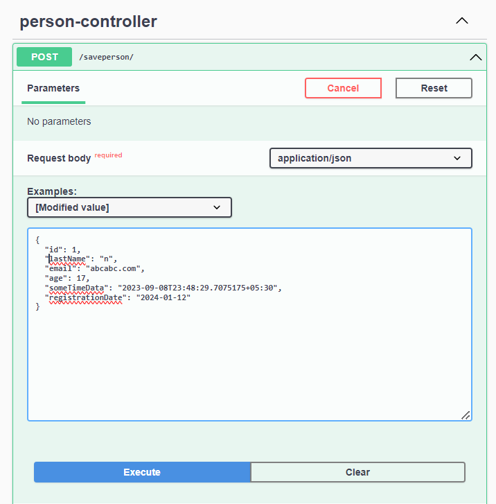 

Press Execute button.  
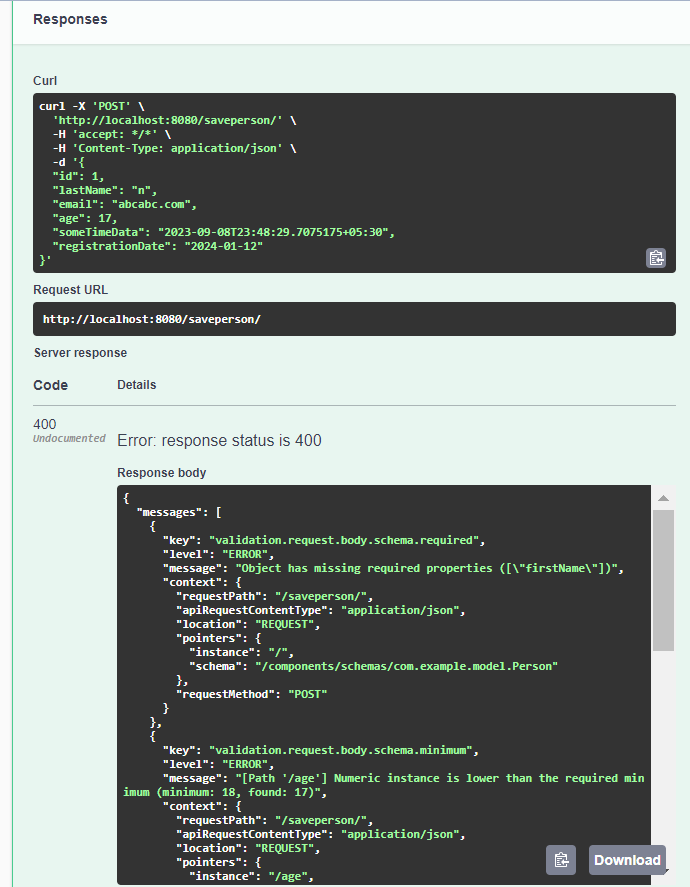 

Listing below the errors:
```json    
{
  "messages": [
    {
      "key": "validation.request.body.schema.required",
      "level": "ERROR",
      "message": "Object has missing required properties ([\"firstName\"])",
      "context": {
        "requestPath": "/saveperson/",
        "apiRequestContentType": "application/json",
        "location": "REQUEST",
        "pointers": {
          "instance": "/",
          "schema": "/components/schemas/com.example.model.Person"
        },
        "requestMethod": "POST"
      }
    },
    {
      "key": "validation.request.body.schema.minimum",
      "level": "ERROR",
      "message": "[Path '/age'] Numeric instance is lower than the required minimum (minimum: 18, found: 17)",
      "context": {
        "requestPath": "/saveperson/",
        "apiRequestContentType": "application/json",
        "location": "REQUEST",
        "pointers": {
          "instance": "/age",
          "schema": "/components/schemas/com.example.model.Person/properties/age"
        },
        "requestMethod": "POST"
      }
    },
    {
      "key": "validation.request.body.schema.pattern",
      "level": "ERROR",
      "message": "[Path '/email'] ECMA 262 regex \".+@.+\\..+\" does not match input string \"abcabc.com\"",
      "context": {
        "requestPath": "/saveperson/",
        "apiRequestContentType": "application/json",
        "location": "REQUEST",
        "pointers": {
          "instance": "/email",
          "schema": "/components/schemas/com.example.model.Person/properties/email"
        },
        "requestMethod": "POST"
      }
    },
    {
      "key": "validation.request.body.schema.minLength",
      "level": "ERROR",
      "message": "[Path '/lastName'] String \"n\" is too short (length: 1, required minimum: 2)",
      "context": {
        "requestPath": "/saveperson/",
        "apiRequestContentType": "application/json",
        "location": "REQUEST",
        "pointers": {
          "instance": "/lastName",
          "schema": "/components/schemas/com.example.model.Person/properties/lastName"
        },
        "requestMethod": "POST"
      }
    }
  ]
}
```	  
Now 

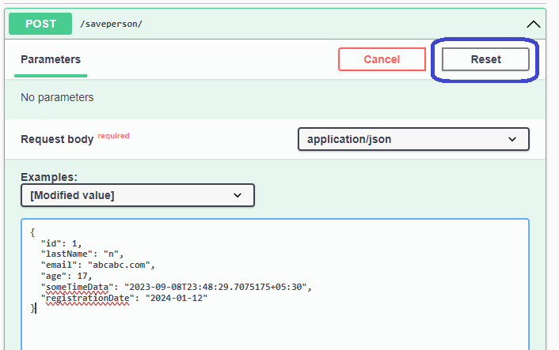 

Press the above reset button.
Pressing the reset button should undo the manual modifications to the input.  

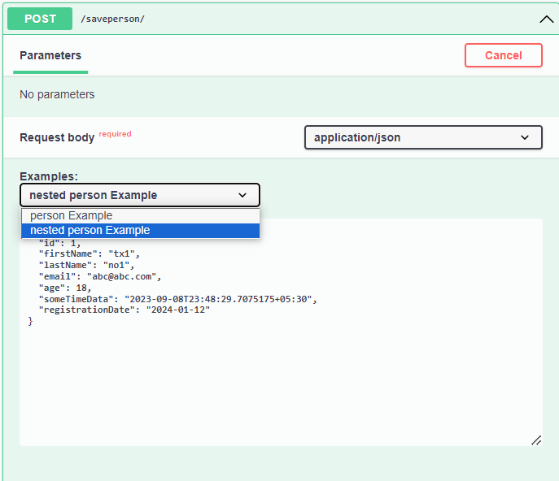 

We can also try the "nested Person Example".   
It will bring in a more complex model data.  

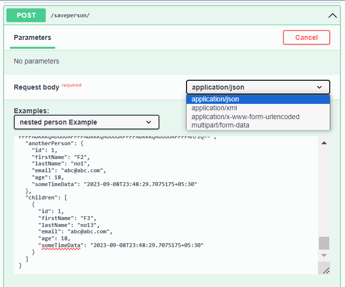 

We can also try the other media types as shown above.  

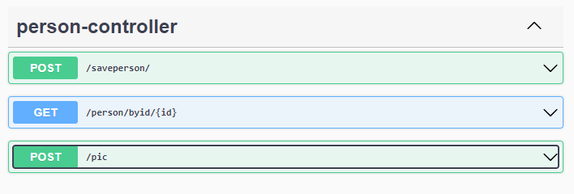 

With this we have had a quick look at the first of the 3 endpoints shown here.  

The second endpoint should be straightforward. It uses a service method that returns an almost hardcoded data.  

The third endpoint is slightly contrived but just to show some other aspects.  

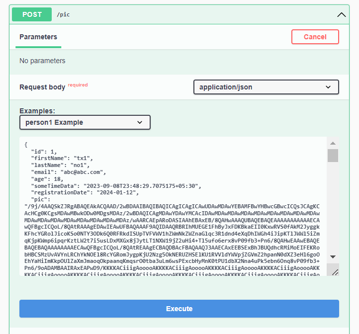  

Thats the request.

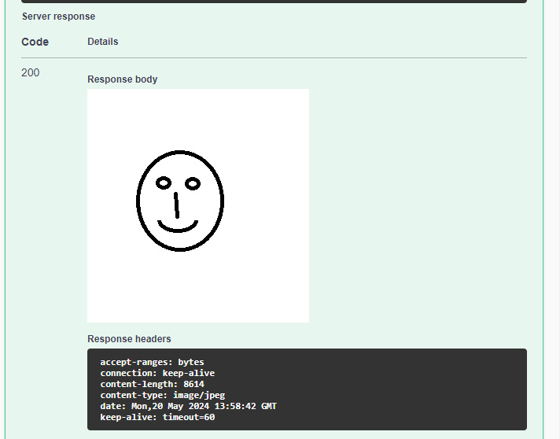

Thats the response.

Please try the other main-examples.   

If interested can go into more-examples folder later to understand what other features are also there for a more complete picture.


