[](../README.md)
[](../extend-no-controller/README.md)
[](README.md)

# extend-modelgen-and-no-controller #


main-examples\extend\extend-modelgen-and-no-controller:  
This is not a very regular spring-boot swagger codegen project by itself.  

It uses a xdamah-maven-codegen-plugin for generating the model code.  
This swagger code generation plugin extends the usual swagger-codegen-maven-plugin. 

Otherwise the only unusual dependencies which you can find in this project by means of the parent pom.xmls is
```xml
<dependency>
	<groupId>io.github.xdamah</groupId>
	<artifactId>xdamah-lib</artifactId>
	<version>${xdamah-version}</version>
</dependency>
```		
and
```xml
<dependency>
	<groupId>com.atlassian.oai</groupId>
	<artifactId>swagger-request-validator-spring-webmvc</artifactId>
</dependency>
```		
Now lets discuss the code:  

```java
@SpringBootApplication(scanBasePackages = { "io.github.xdamah", "com.example" })
public class CustomSchemaAndCustomValidationAndModelGenExampleApplication {
	
	public static void main(String[] args) {

		SpringApplication.run(CustomSchemaAndCustomValidationAndModelGenExampleApplication.class, args);
		
	}

}
```	

Now showing snippet of service class.   

```java
@Service
public class SampleService {

	public Person savePerson(Person person) {
		return person;
	}

	public Resource pic(Person person) {
		ByteArrayResource resource = new ByteArrayResource(person.getPic());

		return resource;
	}

	public Person byid(long id) {
		Person person = new Person();
		person.setId(id);
		person.setFirstName("F");
		person.setLastName("L");
		person.setRegistrationDate(LocalDate.of(2024, 1, 1));
		person.setSomeTimeData(OffsetDateTime.of(2024, 1, 1, 0, 0, 0, 0, ZoneOffset.ofHours(0)));
		person.setSampleCustomTypeData(new SampleCustomType("hello"));
		return person;
	}


}

```	

There is one more code. 

[Modified Atlassian RequestBodyValidator](src/main/java/com/atlassian/oai/validator/interaction/request/RequestBodyValidator.java)
But its really just a means of extending the Atlassian validation components by overwriting that one class. In future it is hoped this can be done in a cleaner manner. 


Atlassian RequestBodyValidator is being customized to handle @Email and  @CreditCardNumber and enforce these validations. This is a demonstration of one of the ways this can be achieved when using Atlassian RequestBodyValidator. Spring validation can also take care of same validation.  


Please see [swagger specifications](api-docs.json).

Lets discuss it a little.

Under "paths" we have briefly below structure (Omitting many details here for brevity).
    
```json
"paths": {
		"/saveperson/": {
			"post": {
				"tags": [
					"person-controller"
				],
				"operationId": "person",
				"x-damah-service": "sampleService.savePerson(com.example.model.Person)"
			}
		},
		"/person/byid/{id}": {
			"get": {
				"tags": [
					"person-controller"
				],
				"operationId": "personbyid",
				"x-damah-service": "sampleService.byid(long)"
			}
		},
		"/pic": {
			"post": {
				"tags": [
					"person-controller"
				],
				"operationId": "person-pic",
				"x-damah-service": "sampleService.pic(com.example.model.Person)"

			}
		}

	}
```	
We see here that the swagger specs is a regular specifications file which uses a x-damah-service to indicate the service bean method that will be invoked by the endpoint.

Thats one concept.  
The model class used by the service class is generated based on "components/schemas" of the swagger-specifications.

Namely:
    
```json
"components": {
	"schemas": {
		"com.example.model.Person": {
			"required": [
				"lastName"
			],
			"type": "object",
			"properties": {
				"id": {
					"type": "integer",
					"format": "int64"
				},
				"firstName": {
					"maxLength": 2147483647,
					"minLength": 2,
					"type": "string"
				},
				"lastName": {
					"type": "string"
				},
				"email": {
					"pattern": ".+@.+\\..+",
					"type": "string"
				},
				"email1": {
					"type": "string",
					"x-Email": true
				},
				"age": {
					"maximum": 30,
					"minimum": 18,
					"type": "integer",
					"format": "int32"
				},
				"creditCardNumber": {
					"type": "string",
					"x-CreditCardNumber": true
				},
				"registrationDate": {
					"type": "string",
					"format": "date"
				},
				"pic": {
					"type": "string",
					"format": "byte"
				},
				"pics": {
					"type": "array",
					"items": {
						"type": "string",
						"format": "byte"
					}
				},
				"sampleCustomTypeData": {
					"$ref": "#/components/schemas/com.example.custom.SampleCustomType"
				},
				"someTimeData": {
					"type": "string",
					"format": "date-time"
				},
				"anotherPerson": {
					"$ref": "#/components/schemas/com.example.model.Person"
				},
				"children": {
					"type": "array",
					"items": {
						"$ref": "#/components/schemas/com.example.model.Person"
					}
				}
			},
			"xml": {
				"name": "person"
			}
		},
		"com.example.custom.SampleCustomType": {
			"type": "object"
		}
	}
}
```	


Till now most of this has been already discussed in the Basic Examples. 
Lets now discuss the differences and new code.

Notice how the Person schema now has
```json
"email1": {
	"type": "string",
	"x-Email": true
},
"creditCardNumber": {
	"type": "string",
	"x-CreditCardNumber": true
}
```	

Here x-Email and x-CreditCardNumber are  swagger extensions and are used to indicate the additional non OOTB constraints.  

The Person schema also has a reference to this custom type   

```json
"sampleCustomTypeData": {
	"$ref": 		"#/components/schemas/com.example.custom.SampleCustomType"
}
```

The schema for same is 	
```json
"com.example.custom.SampleCustomType": {
			"type": "object"
}
```

This is an object based cutom schema example.
Will be in near future adding a strng based custom schema also.


But the main concept here is how when we write the Model classes by hand the swagger documentation for these validations is communicated in the swagger specifications.   

Not showing here but we could also write a custom validator and extend in the same manner.   

 
```	

The place where we knit all these non OOTB validation and custom schema concepts together is in 

```java
@Component
@Primary
public class ValidatorExtension extends BaseValidatorExtension {

	private static final String CREDIT_CARD_EXTN = "x-CreditCardNumber";
	private static final String EMAIL_EXTN = "x-Email";

	@Override
	public void onInitRegisterCustomSchemas() {
		registerCustomSchema(SampleCustomType.class.getSimpleName(), SampleCustomType.class.getName());
	}

	@Override
	protected String[] watchedExtensions() {
		return new String[] { CREDIT_CARD_EXTN, EMAIL_EXTN };
	}

	@Override
	protected HashMap<String, IValidator> mapValidators() {
		HashMap<String, IValidator> hashMap = new HashMap<>();
		hashMap.put(CREDIT_CARD_EXTN, new XdamahCardValidator());
		hashMap.put(EMAIL_EXTN, new SimpleEmailValidator());
		return hashMap;
	}

}
```	

That and referred classes, CustomOpenApiValidator.java are all the code we write.  


We do not have to generate the Rest controller.
We do not generate it in this example because all the information that we code in the rest controller is present in the swagger specs and its extension.


Couple of things are being demonstrated here.
Lets try this out and see:

Visit http://localhost:8080/swagger-ui.html 
 
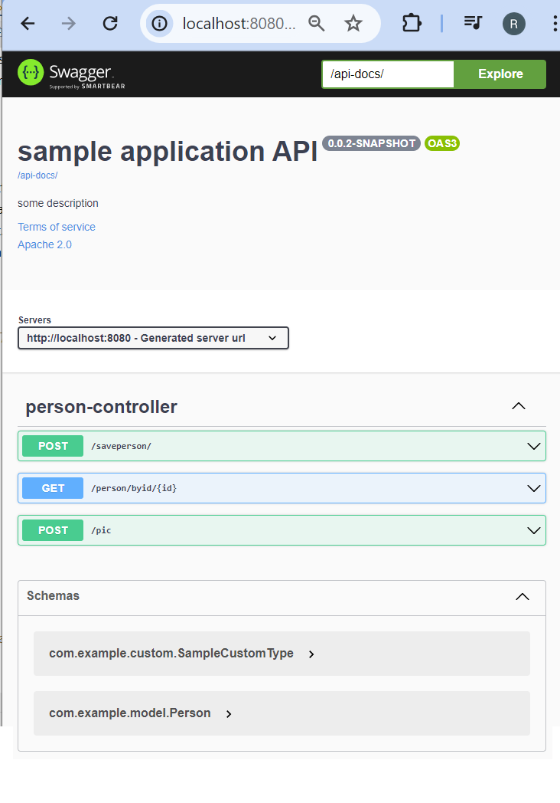  

Expanding the person schema in swagger ui and showing the details

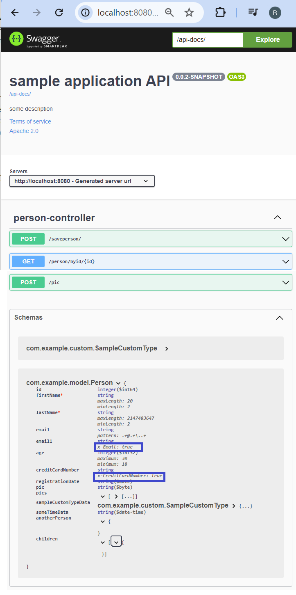  

Showing here how using x-email and x-CreditCardNumber we are using swagger extensions, documenting and communicating regarding these non OOTB constraints.
 
Lets expand Post>save person. Lets click the "Try it out" button.  

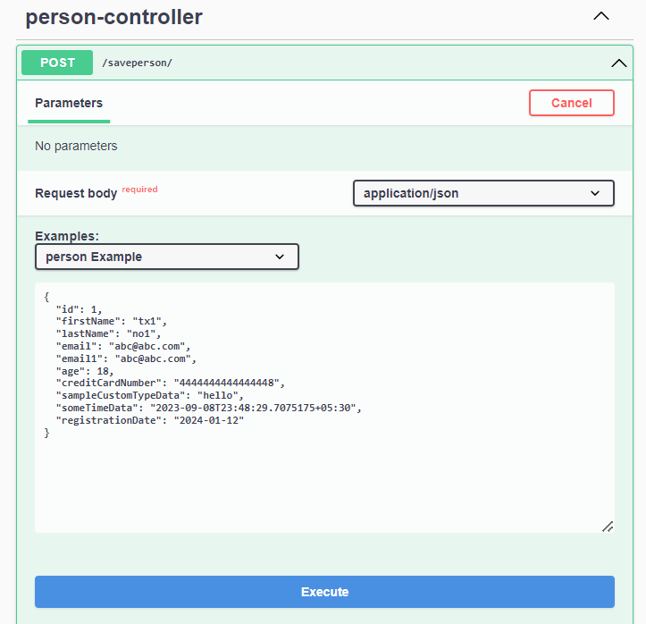 

Press Execute button.  
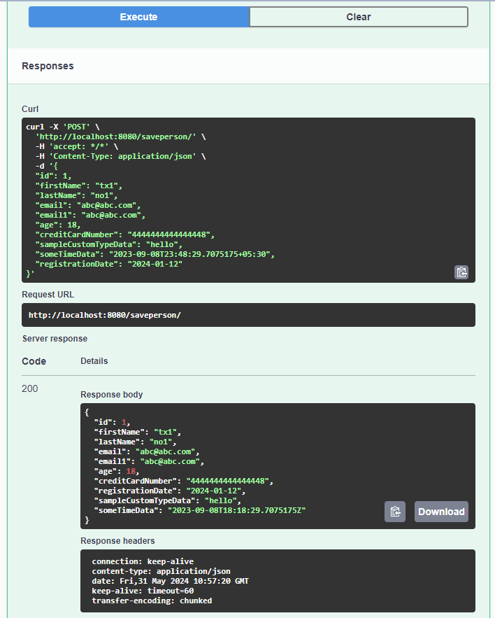 

Last time we submitted this:  

```json  
{
  "id": 1,
  "firstName": "tx1",
  "lastName": "no1",
  "email": "abc@abc.com",
  "email1": "abc@abc.com",
  "age": 18,
  "creditCardNumber": "4444444444444448",
  "sampleCustomTypeData": "hello",
  "someTimeData": "2023-09-08T23:48:29.7075175+05:30",
  "registrationDate": "2024-01-12"
}
```	  

Lets submit this again after changing the input to:  

```json  
{
  "id": 1,
  "firstName": "tx1",
  "lastName": "no1",
  "email": "abc@abc.com",
  "email1": "abcabc.com",
  "age": 18,
  "creditCardNumber": "444444444444444",
  "sampleCustomTypeData": "hello",
  "someTimeData": "2023-09-08T23:48:29.7075175+05:30",
  "registrationDate": "2024-01-12"
}
```	  

Changes are: 

- removed @ from email1, 
- removed last 8 from creditCardNumber.  

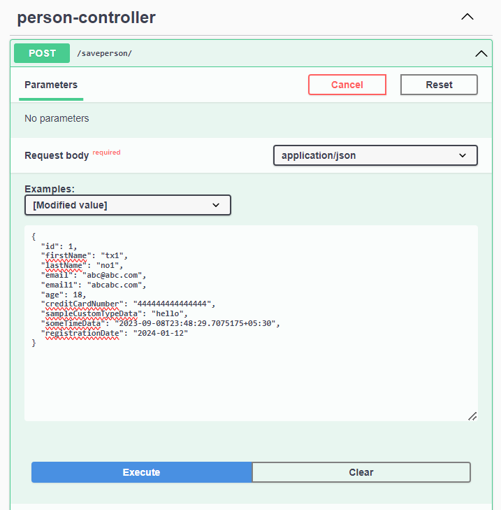 

Press Execute button.  
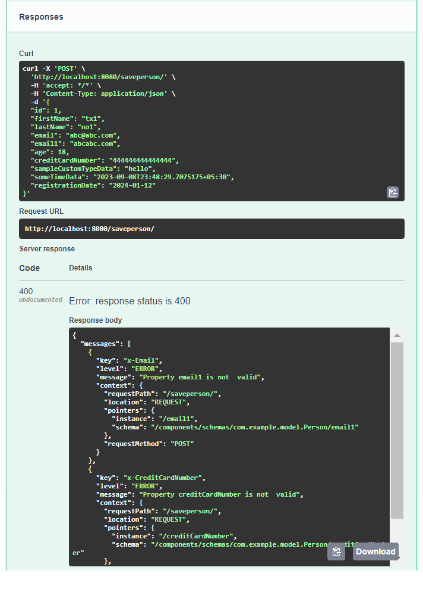 

Listing below the errors:
```json    
{
  "messages": [
    {
      "key": "x-Email",
      "level": "ERROR",
      "message": "Property email1 is not  valid",
      "context": {
        "requestPath": "/saveperson/",
        "location": "REQUEST",
        "pointers": {
          "instance": "/email1",
          "schema": "/components/schemas/com.example.model.Person/email1"
        },
        "requestMethod": "POST"
      }
    },
    {
      "key": "x-CreditCardNumber",
      "level": "ERROR",
      "message": "Property creditCardNumber is not  valid",
      "context": {
        "requestPath": "/saveperson/",
        "location": "REQUEST",
        "pointers": {
          "instance": "/creditCardNumber",
          "schema": "/components/schemas/com.example.model.Person/creditCardNumber"
        },
        "requestMethod": "POST"
      }
    }
  ]
}
```	  
Now 

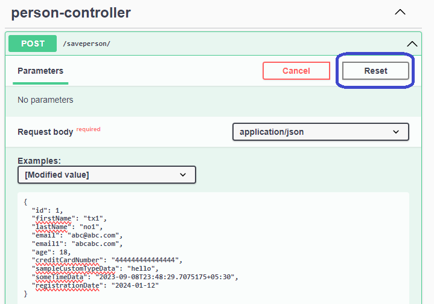 

Press the above reset button.
Pressing the reset button should undo the manual modifications to the input.  

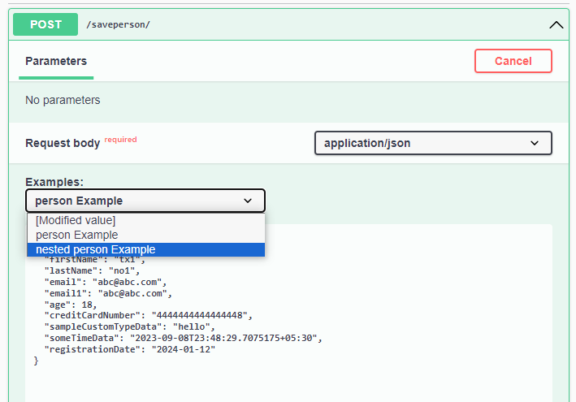 

We can also try the "nested Person Example".   
It will bring in a more complex model data.  

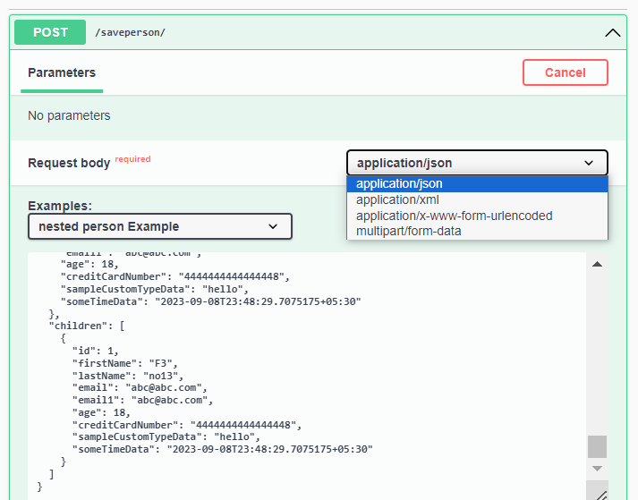  

We can also try the other media types as shown above.  
Note: Use postman when trying for application/x-www-form-urlencoded or multipart/form-data requests.


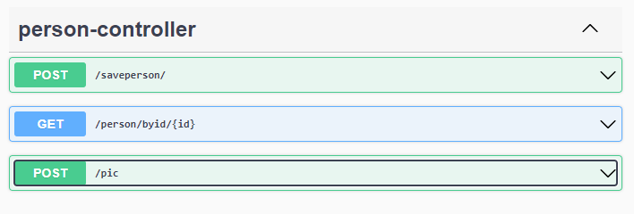 

With this we have had a quick look at the first of the 3 endpoints shown here.  

The second endpoint should be straightforward. It uses a service method that returns an almost hardcoded data.  

The third endpoint is slightly contrived but just to show some other aspects.  

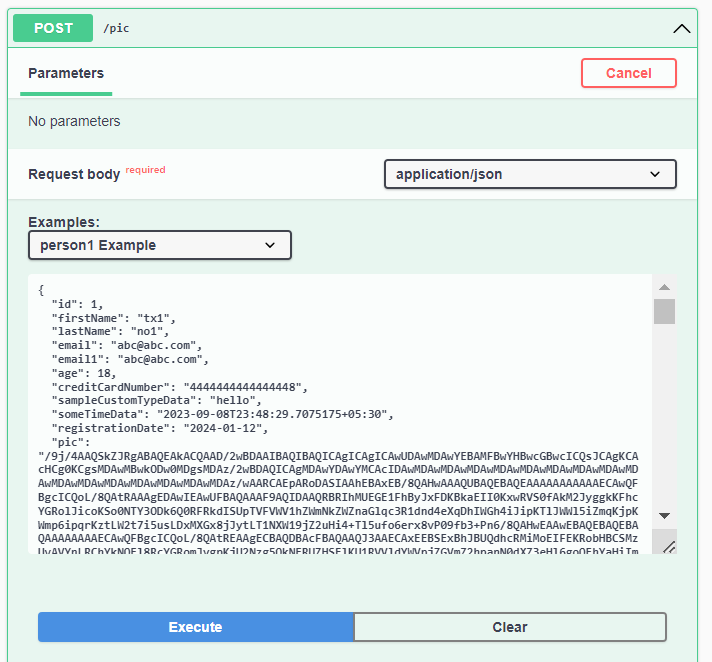  

Thats the request.

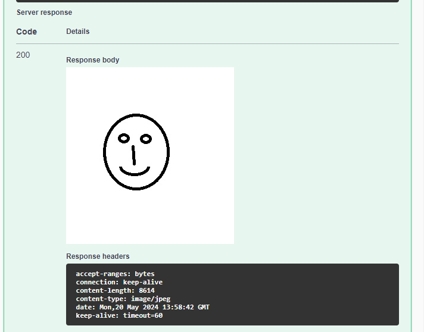

Thats the response.

Please try the other [extend no controller example](../extend-no-controller/README.md).   

After that please try the  [Main Examples](../../README.md).  

If interested can go into more-examples folder later to understand what other features are also there for a more complete picture.


