[](../README.md)
[](README.md)
[](../polymorphic-modelgen-and-no-controller/README.md)

# polymorphic-no-controller #


main-examples\polymorphic\polymorphic-no-controller:
This is a very regular spring-boot project by itself. Its a bit different from  the basic example we must have seen earlier.  

The only unusual dependencies which you can find in this project by means of the parent pom.xmls is
```xml
<dependency>
	<groupId>io.github.xdamah</groupId>
	<artifactId>xdamah-lib</artifactId>
	<version>${xdamah-version}</version>
</dependency>
```		
and
```xml
<dependency>
	<groupId>com.atlassian.oai</groupId>
	<artifactId>swagger-request-validator-spring-webmvc</artifactId>
</dependency>
```		
Now lets discuss the code:  

```java
@SpringBootApplication(scanBasePackages = { "io.github.xdamah", "com.example" })
public class PolymorphicNoControllerExampleApplication {
	public static void main(String[] args) {
		
		SpringApplication.run(PolymorphicNoControllerExampleApplication.class, args);
	}
	@PostConstruct
	void init()
	{
		TypeNameResolver.std.setUseFqn(true);
		ModelConverters.getInstance().addConverter(new SubTypedPropertyConverter());
		
	}
}
```	

Next showing a snippet of the model classes.   
```java
@JsonTypeInfo(
		  use = JsonTypeInfo.Id.NAME,
		  include = JsonTypeInfo.As.PROPERTY,
		  property = "type")
		@JsonSubTypes({
		  @JsonSubTypes.Type(value = FlightRequest.class, name = "FlightRequest"),
		  @JsonSubTypes.Type(value = CarRequest.class, name = "CarRequest"),
		  @JsonSubTypes.Type(value = HotelRequest.class, name = "HotelRequest")
		})
public class BaseRequest   {
@NotNull
  private String type = null;
  private OffsetDateTime startDateTime = null;
  private OffsetDateTime endDateTime = null;
}	
```	
```java
public class CarRequest extends BaseRequest {
  private String from = null;
  private String to = null;
  private String vehicleType = null;
}

```	

```java
public class FlightRequest extends BaseRequest {
  private String fromAirport = null;
  private String toAirport = null;
  private String seatType = null;
}
```	

```java
public class HotelRequest extends BaseRequest  {
  private String hotelName = null;
  private String roomType = null;
  private String location = null;
}
```	

```java
@Schema(subTypes = {StoredTrip.class})
public class Trip   {
  private String tripName = null;
  private List<BaseRequest> requests = null;
}

```	

```java
public class StoredTrip extends Trip  {
   private Long tripId = null;
}


```	
Now showing snippet of service class.   

```java
@Service
public class SampleService {
	private Map<Long, StoredTrip> trips = new LinkedHashMap<>();
	private final AtomicLong counter = new AtomicLong();

	public StoredTrip createTrip(Trip trip) {
		StoredTrip storedTrip = new StoredTrip();

		try {
			BeanUtils.copyProperties(storedTrip, trip);
		} catch (IllegalAccessException | InvocationTargetException e) {
			throw new IllegalArgumentException("Unable to store trip");
		}
		long newId = counter.incrementAndGet();
		storedTrip.setTripId(newId);
		trips.put(newId, storedTrip);
		return storedTrip;

	}

	public StoredTrip addRequest(long tripid, BaseRequest request) {

		StoredTrip trip = trips.get(tripid);
		if (trip == null) {
			throw new IllegalArgumentException("invalid trip id of " + tripid);
		} else {
			List<BaseRequest> requests = trip.getRequests();
			if (requests == null) {
				requests = new ArrayList<BaseRequest>();
				trip.setRequests(requests);
			}
			requests.add(request);
		}

		return trip;
	}

	public StoredTrip getTrip(long tripId) {
		StoredTrip trip = trips.get(tripId);
		if (trip == null) {
			throw new IllegalArgumentException("invalid trip id of " + tripId);
		}

		return trip;
	}

}

```	

There is one more code. 

[Modified Atlassian RequestBodyValidator](src/main/java/com/atlassian/oai/validator/interaction/request/RequestBodyValidator.java)
But its really just a means of extending the Atlassian validation components by overwriting that one class. In future it is hoped this can be done in a cleaner manner. 


Till now most of this has been already discussed in the Basic Examples. 

Lets now discuss the differences and new code.

In PolymorphismExampleApplication.java the main class in method adjustModelConverters() we are doing some changes to the model conversion logic.   

Mainly we have added a SubTypedPropertyConverter class into mix.  
This class is provided as a reference. Feel free to borrow the logic and customize in another custom class. 

Polymorphism in model design is demonstrated here.

But the main concept here is how when we write the Model classes by hand the swagger documentation is communicated in the swagger specifications.   


That is all the code we write.  


We do not have to write the Rest controller.
We do not write it in this example because all the information that we code in the rest controller is present in the swagger specs and its extension.


Please see [swagger specifications](api-docs.json).

Lets discuss it a little.

Under "paths" we have briefly below structure (Omitting many details here for brevity).
    
```json
"paths": {
		"/createtrip": {
			"post": {
				"tags": [
					"trip"
				],
				"operationId": "createtrip",
				"x-damah-service": "sampleService.createTrip(com.example.trip.Trip)"
			}
		},
		"/trips/{tripid}": {
			"get": {
				"tags": [
					"trip"
				],
				"operationId": "triprequests",
				"x-damah-service": "sampleService.getTrip(long)"
			}
		},
		"/addrequest/{tripid}": {
			"post": {
				"tags": [
					"trip"
				],
				"operationId": "addrequest",
				"x-damah-service": "sampleService.addRequest(long, com.example.request.BaseRequest)"
			}
		}
	}
```	
We see here that the swagger specs is a regular specifications file which uses a x-damah-service to indicate the service bean method that will be invoked by the endpoint.

Thats one concept.  
We saw how the model class was written along-with the service class. We can manually repeat the model class definitions in the "components/schemas" of the swagger-specifications.

Alternatively we can do this:
    
```json
"components": {
	"schemas": {
		"x-damah-models": ["com.example.request.BaseRequest", 
			"com.example.trip.Trip", 
			"com.example.trip.StoredTrip"]
		
	}
}
```	
At runtime we are expecting this to be converted into the proper schema definitions of the model class.   We will show that in a very short while.  

Referred to this.

https://swagger.io/docs/specification/data-models/inheritance-and-polymorphism/

Have supported discriminator/propertyName.

Yet to support discriminator/mapping.  (Its a WIP for now on my part)


Lets try this out and see:

Visit http://localhost:8080/swagger-ui.html 
 
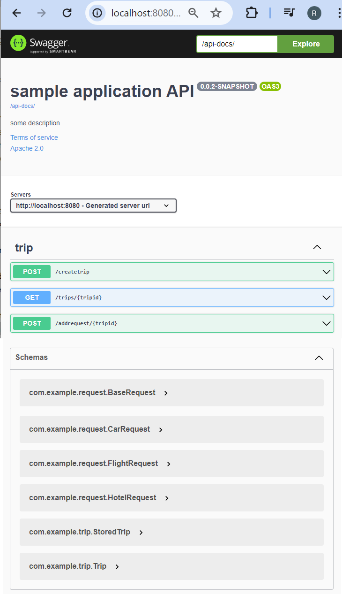  

Lets visit http://localhost:8080/api-docs/ and scroll down. 

```json  
"schemas": {
			"com.example.request.BaseRequest": {
				"discriminator": {
					"propertyName": "type"
				},
				"properties": {
					"type": {
						"type": "string"
					},
					"startDateTime": {
						"type": "string",
						"format": "date-time"
					},
					"endDateTime": {
						"type": "string",
						"format": "date-time"
					}
				},
				"required": [
					"type"
				]
			},
			"com.example.request.CarRequest": {
				"allOf": [
					{
						"$ref": "#/components/schemas/com.example.request.BaseRequest"
					},
					{
						"type": "object",
						"properties": {
							"from": {
								"type": "string"
							},
							"to": {
								"type": "string"
							},
							"vehicleType": {
								"type": "string"
							}
						}
					}
				],
				"required": [
					"type"
				]
			},
			"com.example.request.FlightRequest": {
				"allOf": [
					{
						"$ref": "#/components/schemas/com.example.request.BaseRequest"
					},
					{
						"type": "object",
						"properties": {
							"fromAirport": {
								"type": "string"
							},
							"toAirport": {
								"type": "string"
							},
							"seatType": {
								"type": "string"
							}
						}
					}
				],
				"required": [
					"type"
				]
			},
			"com.example.request.HotelRequest": {
				"allOf": [
					{
						"$ref": "#/components/schemas/com.example.request.BaseRequest"
					},
					{
						"type": "object",
						"properties": {
							"hotelName": {
								"type": "string"
							},
							"roomType": {
								"type": "string"
							},
							"location": {
								"type": "string"
							}
						}
					}
				],
				"required": [
					"type"
				]
			},
			"com.example.trip.StoredTrip": {
				"allOf": [
					{
						"$ref": "#/components/schemas/com.example.trip.Trip"
					},
					{
						"type": "object",
						"properties": {
							"tripId": {
								"type": "integer",
								"format": "int64"
							}
						}
					}
				]
			},
			"com.example.trip.Trip": {
				"properties": {
					"tripName": {
						"type": "string"
					},
					"requests": {
						"type": "array",
						"items": {
							"discriminator": {
								"propertyName": "type"
							},
							"oneOf": [
								{
									"$ref": "#/components/schemas/com.example.request.FlightRequest"
								},
								{
									"$ref": "#/components/schemas/com.example.request.CarRequest"
								},
								{
									"$ref": "#/components/schemas/com.example.request.HotelRequest"
								}
							]
						}
					}
				}
			}
		}
```	
The above shows the result of "x-damah-models": ["com.example.request.BaseRequest", "com.example.trip.Trip", "com.example.trip.StoredTrip"] in the actual swagger specifications.  


Having said all this will proceed: 

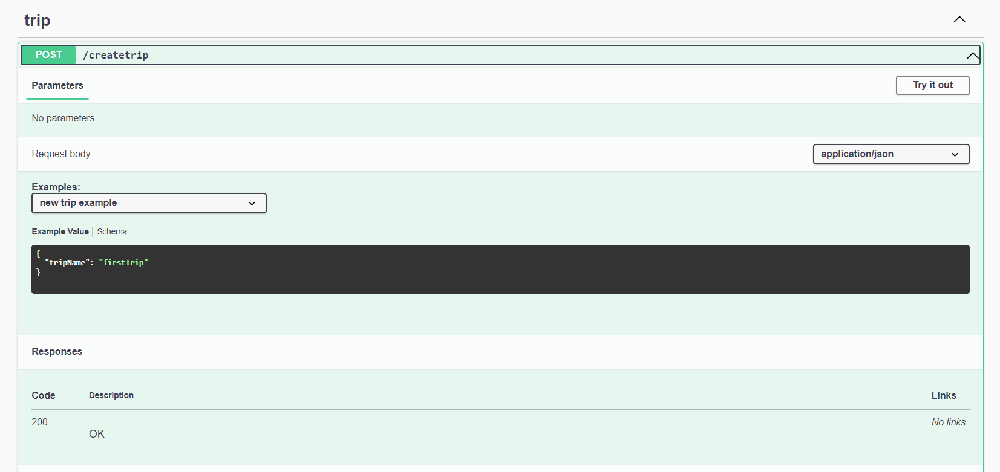   

Press "Try out". Press "Execute". 

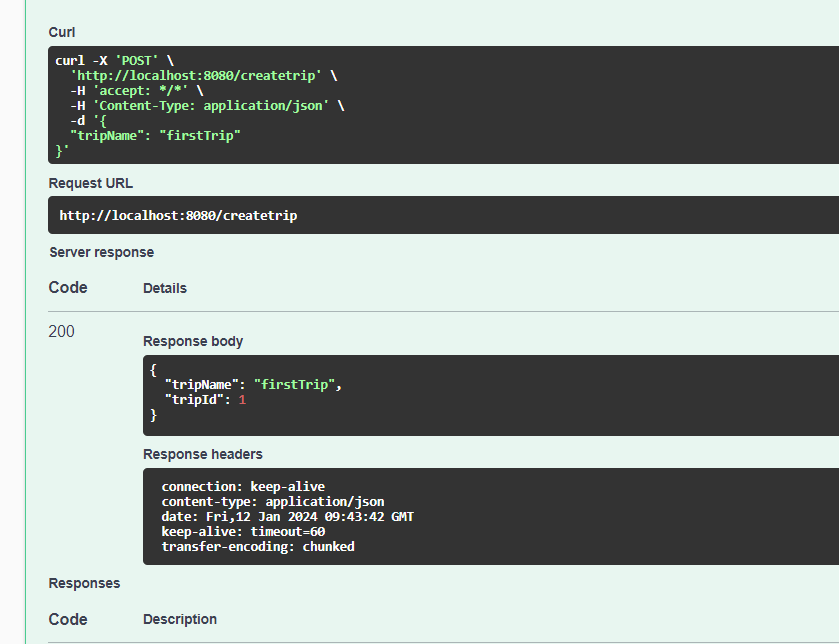   

This is one way of creating a trip.   
Lets create another trip in a different way.   

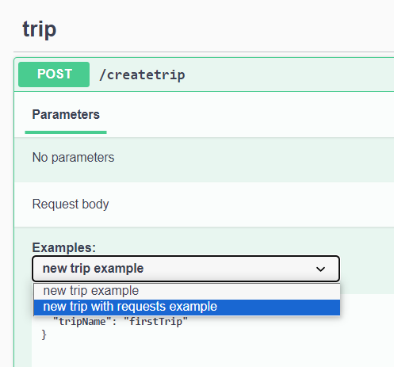  

That looks like this.   

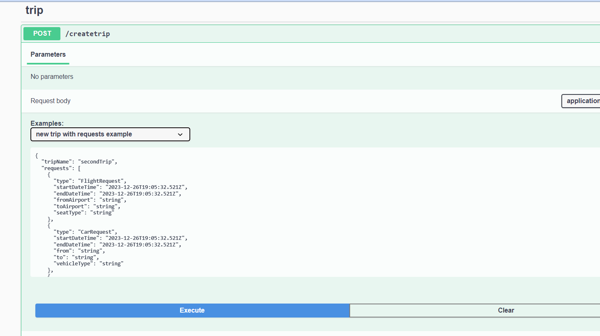  

And response looks like the below.    
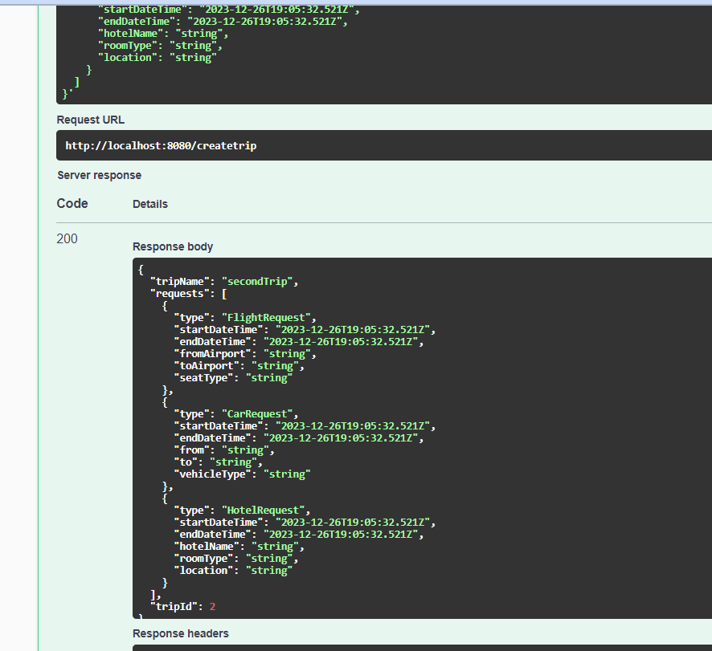   

So far we have created two trips and the trip ids can be seen in the responsees.  

Lets try fetching a trip using a non existent trip id.   

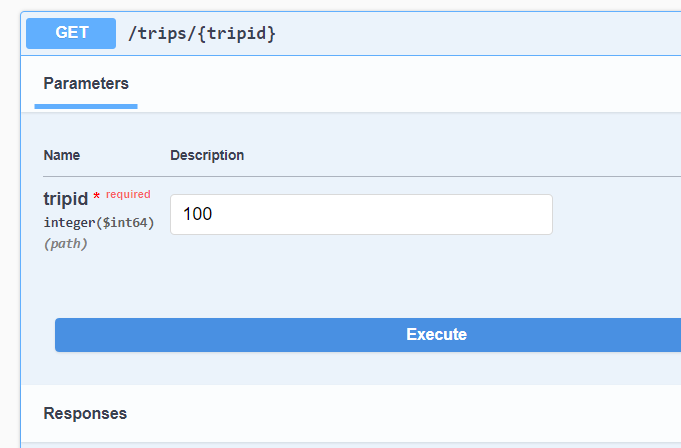   

Getting below response.  
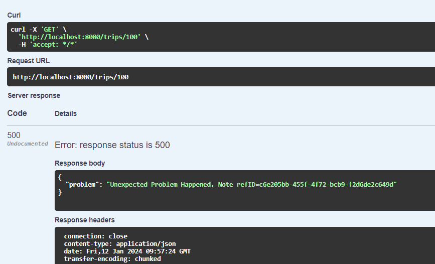   

In this example have chosen to not reveal the actual problem.  

We have seen in this example so far two trip ids of 1 and 2.

Lets try with them.

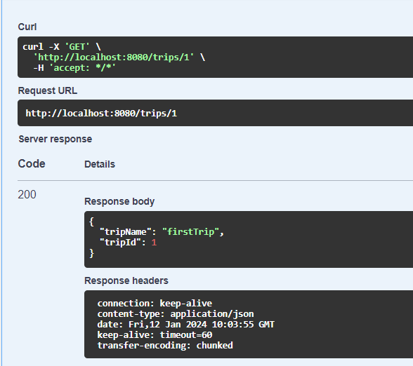    

we get above for tripId of 1.  

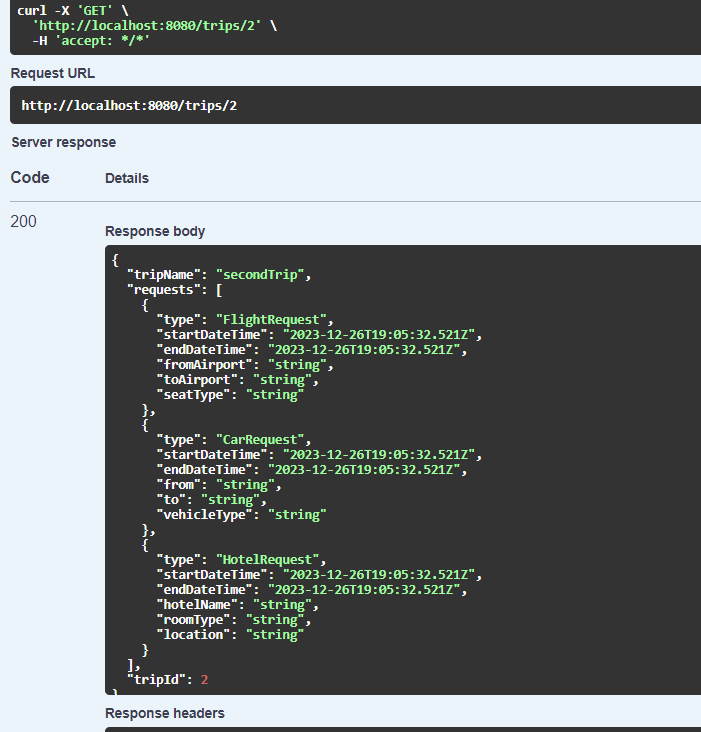    

we get above for tripId of 2.  


Lets now try the add request functionality.  


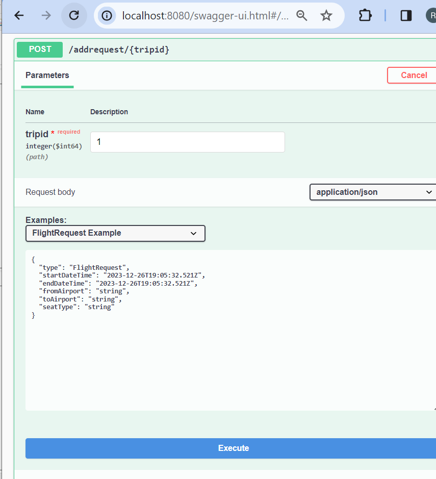  

Trip Id of 1 which did not have any requests earlier now has the flight request added.  

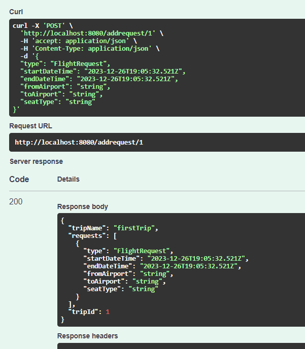  

Lets now select a car request to add.   


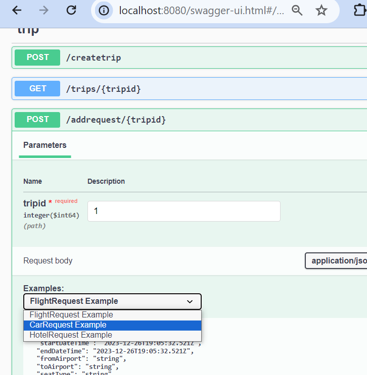  

That looks like this.   

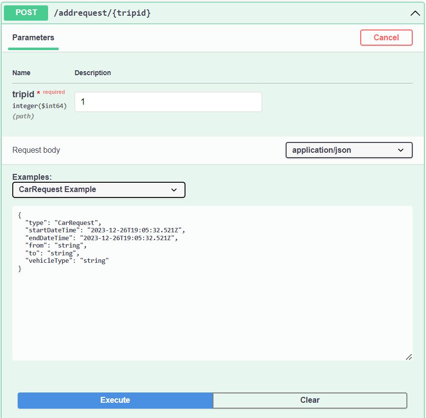 

Response looks like below

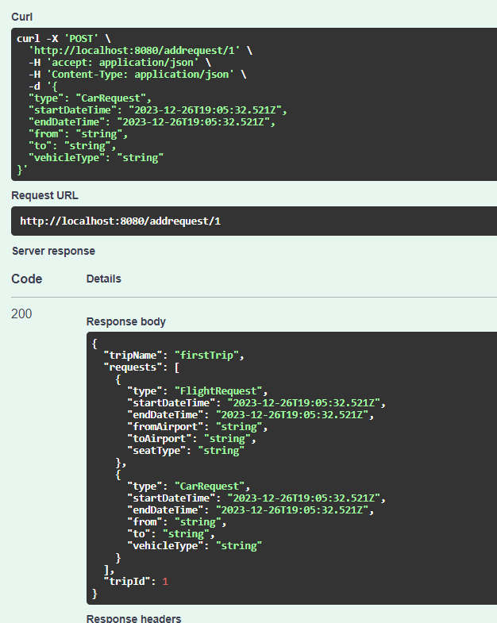 

Similarly try with a Hotel Request.   


Please try the other [polymorphic modelgen and no controller example](../polymorphic-modelgen-and-no-controller/README.md).  

After that please try the [Main Examples](../../README.md).     
   

If interested can go into more-examples folder later to understand what other features are also there for a more complete picture.


